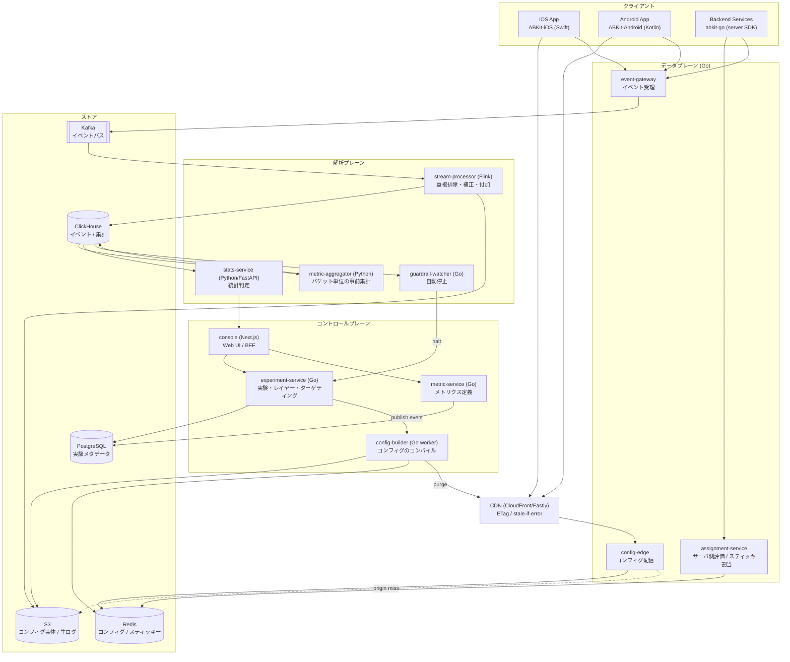
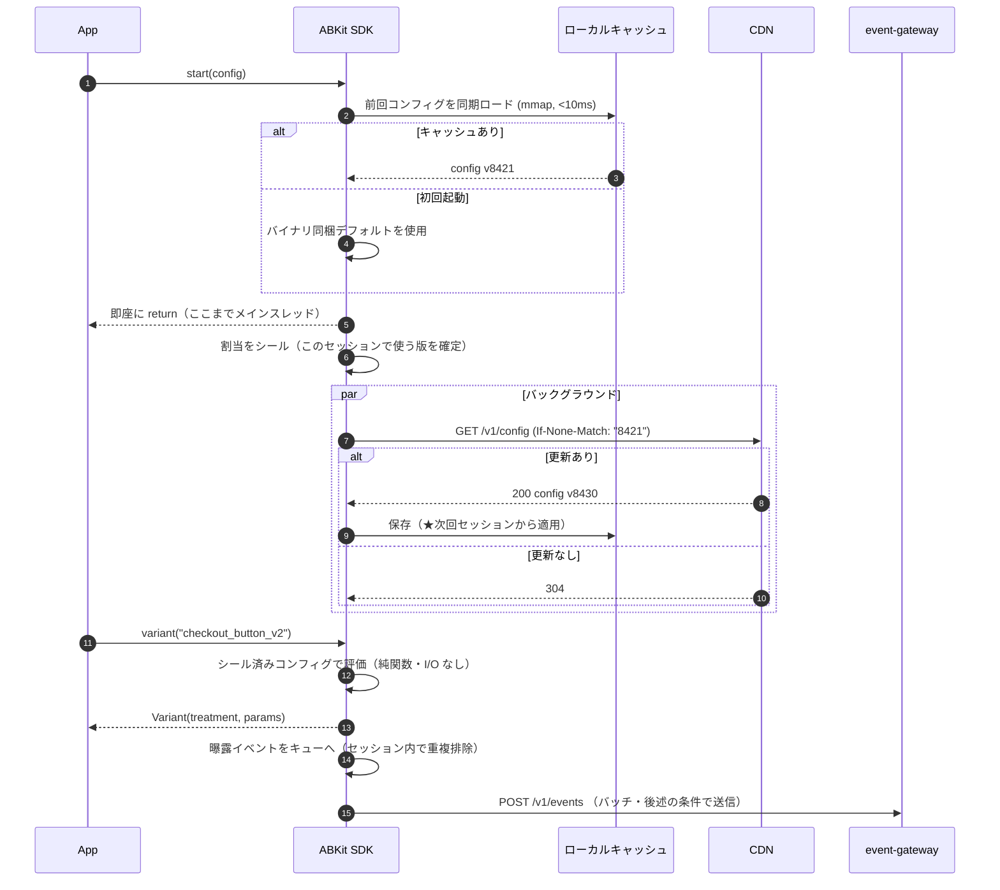
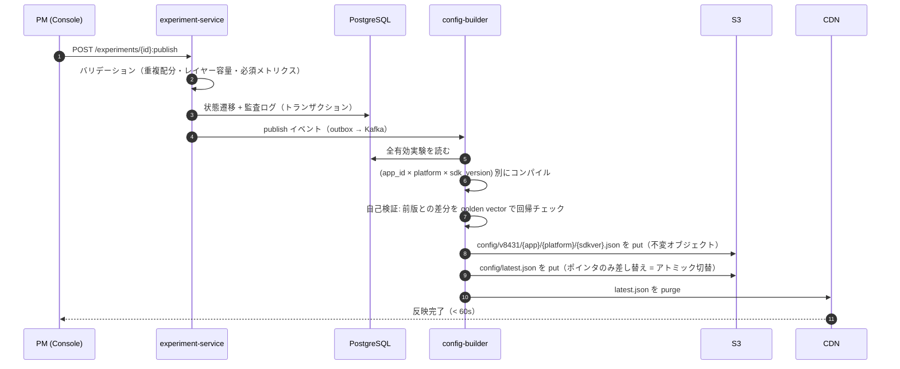
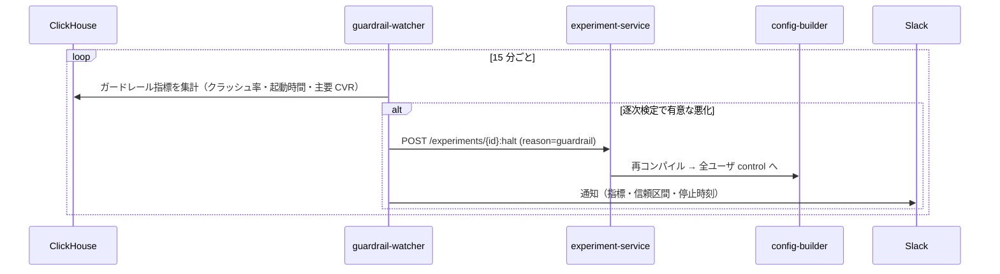
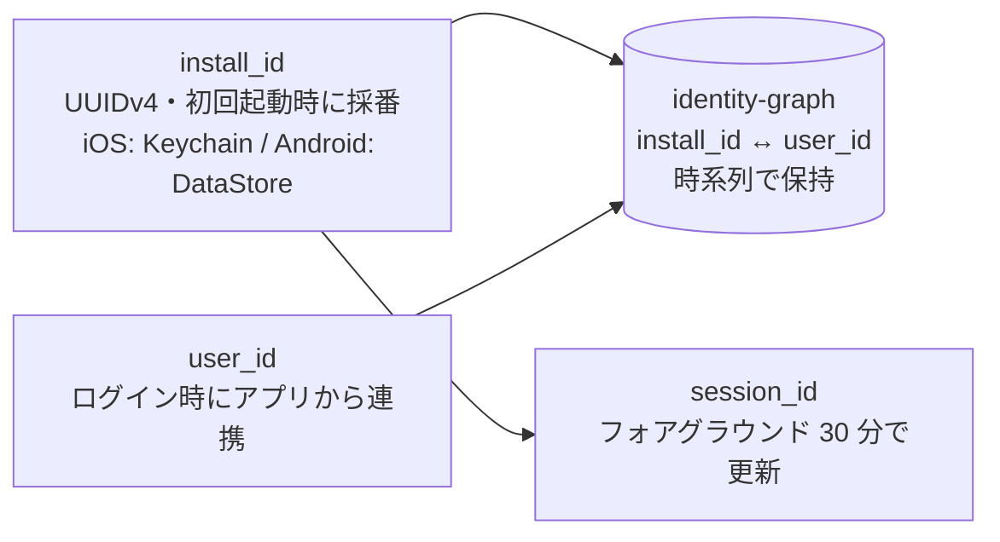

# 02. アーキテクチャ

## 1. 全体像

3 つの平面に分ける。分割の基準は「壊れたときに何が止まるか」であって、機能の粒度ではない。

- **コントロールプレーン** — 実験を定義・公開する。止まっても**稼働中の実験は動き続ける**（新規公開ができなくなるだけ）。
- **データプレーン** — コンフィグを配り、イベントを受ける。止まると**アプリの挙動に影響する**。最高の可用性が要る。
- **解析プレーン** — イベントを集計し結果を出す。止まっても**意思決定が遅れるだけ**。

この非対称性が、後述の技術選定（言語・ストア・デプロイ単位）をほぼ決めている。

## 2. 何が壊れたら何が起きるか（障害設計）

これを先に決めてから各サービスを設計する。

| 故障 | 影響 | 縮退動作 |
|---|---|---|
| CDN 障害 | コンフィグ更新が届かない | SDK はローカルキャッシュで動作継続。挙動は変わらない |
| config-edge 全損 | 同上 | CDN が `stale-if-error` で古いオブジェクトを配り続ける |
| Redis 全損 | オリジンのレイテンシ悪化 | config-edge が S3 の同一オブジェクトにフォールバック |
| PostgreSQL 全損 | 実験の新規公開・変更が不可 | 稼働中の実験は無影響（コンフィグは S3/CDN 上で自己完結） |
| event-gateway 全損 | イベントが送れない | SDK が端末内キューに滞留させ後で再送。**解析が遅れるだけ** |
| Kafka 障害 | 同上 | gateway がローカルディスクにスプールし復旧後に流す |
| ClickHouse 障害 | 結果が見られない | 実験の稼働には無影響 |
| **SDK 初期化失敗** | — | バイナリ同梱デフォルトで全実験 control 相当。**アプリは必ず起動する** |

設計原則: **解析プレーンの障害がユーザ体験に伝播する経路を一つも作らない。** guardrail-watcher が experiment-service を叩く矢印だけが解析→制御の依存で、これは「止める」方向にしか働かない。

## 3. 主要シーケンス

### 3.1 アプリ起動〜割当（正常系）

**要点:** フェッチしたコンフィグは**そのセッションでは使わない**。次回起動から効く。これが C1/C6 に対する構造的な答えで、詳細は [ADR-0005](adr/0005-session-sealed-config.md)。

### 3.2 実験の公開

**要点:** コンフィグは**不変オブジェクト + ポインタ差し替え**。ロールバックはポインタを前の版に戻すだけで数秒。部分的に壊れた状態が観測されることがない。

### 3.3 ガードレール自動停止

## 4. サービス分割の方針

「Phase 1 から 10 個のサービスを立てる」のは誤り。以下の順で**割る理由が生じたときに割る**。

| デプロイ単位 | Phase 1 | 分割する理由 |
|---|---|---|
| `config-edge` | ✅ 最初から独立 | 可用性要件が突出。他と一緒に落としたくない |
| `event-gateway` | ✅ 最初から独立 | トラフィック特性が全く違う（書き込み一辺倒・スパイク） |
| `control-plane`（experiment + metric + builder + console BFF） | ✅ 1 つの塊 | 内部整合性が強く、トラフィックも小さい。分ける利得がない |
| `stats-service` | ✅ 独立 | 言語が違う（Python）。ランタイム要件が違う |
| experiment / metric / builder の分離 | Phase 3 | builder の負荷が API を圧迫し始めたら |
| `assignment-service` | Phase 2 | サーバ側実験を始めるとき |

つまり **Phase 1 は 4 デプロイ単位**。マイクロサービスの粒度は組織とトラフィックの関数であり、最初から細かく割ると分散トランザクションの負債だけが先に来る。

## 5. サービス間通信

| 経路 | プロトコル | 理由 |
|---|---|---|
| SDK → config-edge | HTTPS / JSON + gzip | CDN でキャッシュできること、curl でデバッグできることが最優先 |
| SDK → event-gateway | HTTPS / JSON バッチ + zstd | 同上。スキーマは JSON Schema でゲートウェイ側検証 |
| 内部サービス間（同期） | gRPC | 型安全、双方向ストリーム、コード生成 |
| 内部（非同期） | Kafka + Protobuf | スキーマ進化、Schema Registry で互換性強制 |
| experiment → builder | Transactional Outbox → Kafka | DB 更新とイベント発行の原子性。二重公開・公開漏れを防ぐ |

**JSON か Protobuf か**は経路で分ける。外向き（SDK 対向）は JSON — CDN キャッシュ・人間による調査・SDK 実装の容易さが効く。内向きは Protobuf — スキーマ強制と効率が効く。統一しようとすると必ずどちらかが不幸になる。

## 6. 識別子モデル

| 単位 | 使いどころ | 注意 |
|---|---|---|
| `install_id` | 未ログイン含む全ユーザ対象の実験、オンボーディング | 再インストールで変わる（iOS Keychain は残存させるか要判断。プライバシー観点で「残さない」を既定にする） |
| `user_id` | ログイン後の機能、複数端末で一貫させたい実験 | ログイン前は評価できない。`identify()` まで待つ |
| `account_id` | 家族/法人アカウント単位の機能 | 単位内の相関でσが上がる → クラスタ頑健分散が必要（[07 章](07-statistics.md)） |
| `session_id` | レイテンシ最適化など、持ち越し効果のない実験のみ | 学習効果のある UI 実験には使ってはいけない |

`identity-graph` は解析時にログイン前後を接続するために使う。**割当そのものには使わない**（割当は常に単一の ID だけに依存させる。そうしないと決定性が壊れる）。
