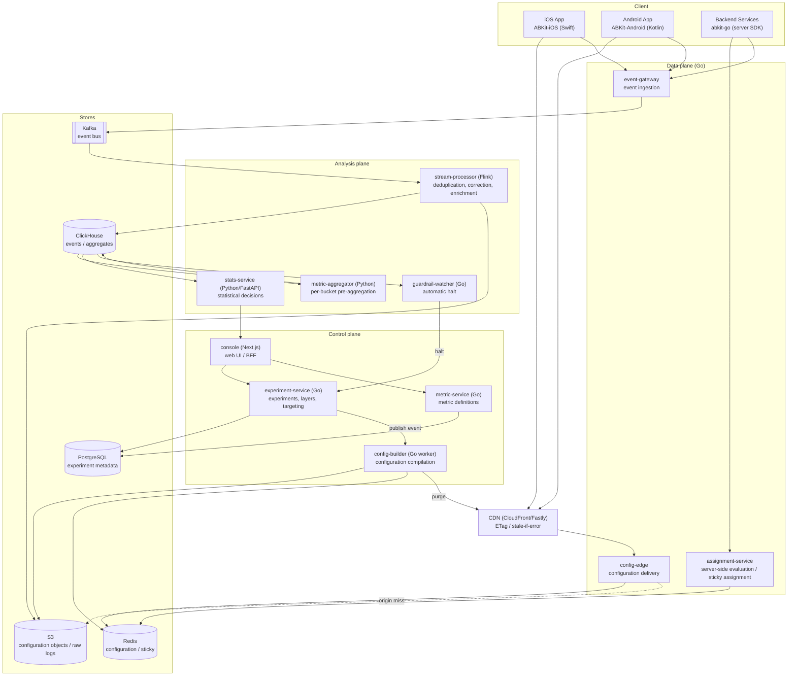
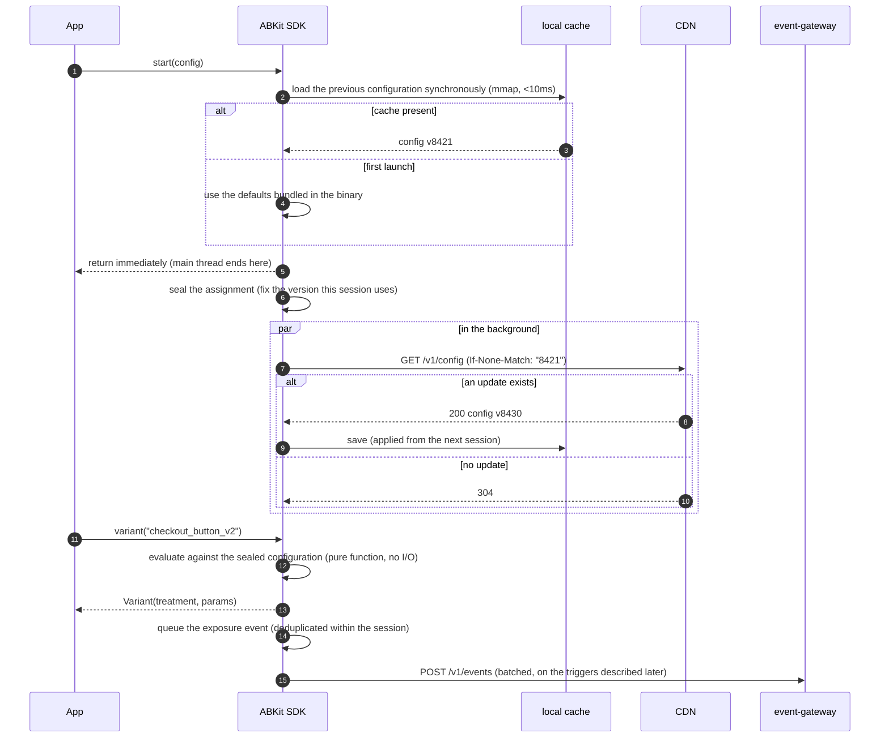
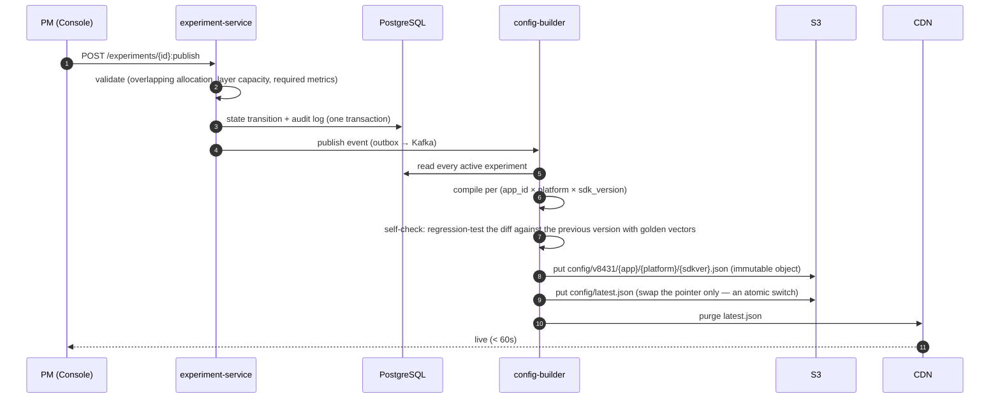
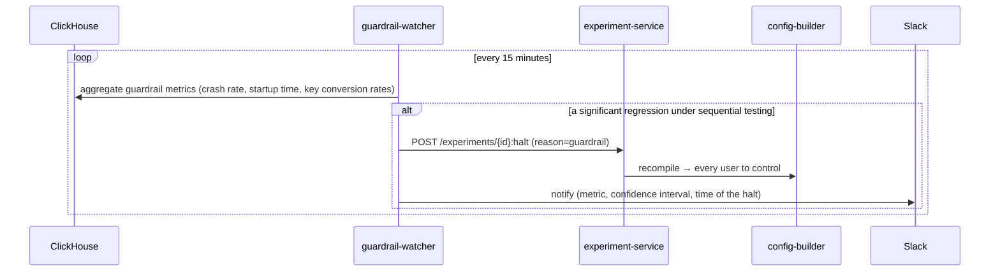
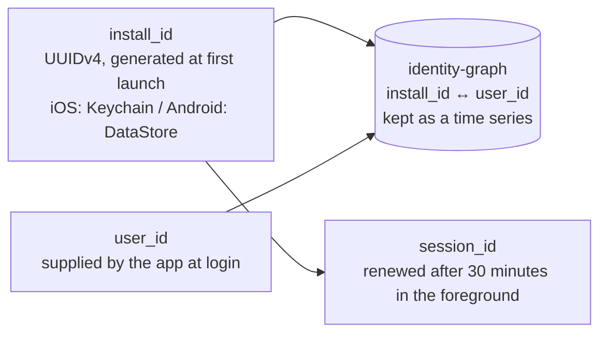

**English** · [日本語](02-architecture-ja.md)

# 02. Architecture

## 1. The whole picture

The system splits into three planes. The criterion for the split is what stops working when a plane
breaks, not how finely the features divide.

- **Control plane** — defines and publishes experiments. If it stops, **running experiments keep running**; only new publications become impossible.
- **Data plane** — delivers configuration and receives events. If it stops, **app behavior is affected**. It needs the highest availability.
- **Analysis plane** — aggregates events and produces results. If it stops, **decisions are merely delayed**.

That asymmetry settles most of the technology selection that follows — the languages, the stores,
and the deployment units.

## 2. What happens when each part breaks

Settle this table before designing any individual service.

| Failure | Impact | Degraded behavior |
|---|---|---|
| CDN outage | Configuration updates do not reach devices | The SDK keeps running from its local cache. Behavior does not change |
| config-edge entirely lost | The same | The CDN keeps serving the stale object under `stale-if-error` |
| Redis entirely lost | Origin latency degrades | config-edge falls back to the identical object in S3 |
| PostgreSQL entirely lost | No experiment can be published or changed | Running experiments are unaffected, because the configuration is self-contained on S3 and the CDN |
| event-gateway entirely lost | Events cannot be sent | The SDK holds events in its on-device queue and retries later. **Only the analysis is delayed** |
| Kafka outage | The same | The gateway spools to local disk and drains after recovery |
| ClickHouse outage | Results cannot be viewed | Running experiments are unaffected |
| **SDK initialization failure** | — | The bundled defaults put every experiment at its control-equivalent value. **The app always starts** |

The design principle behind the table: **no path exists by which a failure in the analysis plane
propagates to the user experience.** The arrow from guardrail-watcher to experiment-service is the
only dependency running from analysis to control, and it can only ever stop an experiment.

## 3. The main sequences

### 3.1 App startup through assignment, on the happy path

**The key point:** a fetched configuration **is not used in the session that fetched it**. It takes
effect from the next launch. That behavior is the structural answer to constraints C1 and C6, and
[BK-0005](../roadmaps/BK-0005-session-sealed-config/BK-0005-session-sealed-config.md) records the
reasoning.

### 3.2 Publishing an experiment

**The key point:** configuration is an **immutable object plus a pointer swap**. A rollback moves
the pointer back to the previous version and takes seconds, and no partially broken state is ever
observable.

### 3.3 An automatic guardrail halt

## 4. How the services are split

Standing up ten services in Phase 1 would be a mistake. Split in the order below, **when a reason to
split appears**.

| Deployment unit | Phase 1 | Reason to split it out |
|---|---|---|
| `config-edge` | ✅ separate from the start | Its availability requirement stands far above the rest, and it must not go down with anything else |
| `event-gateway` | ✅ separate from the start | Its traffic profile is entirely different: write-dominated and spiky |
| `control-plane` (experiment + metric + builder + console BFF) | ✅ one unit | Internally consistent and low-traffic. Splitting it buys nothing |
| `stats-service` | ✅ separate | A different language (Python) and different runtime requirements |
| Separating experiment / metric / builder | Phase 3 | Once the builder's load starts crowding out the API |
| `assignment-service` | Phase 2 | When server-side experiments begin |

**Phase 1 therefore has four deployment units.** Microservice granularity is a function of the
organization and the traffic; splitting finely from the start delivers the debt of distributed
transactions before any of the benefit.

## 5. Communication between services

| Path | Protocol | Reason |
|---|---|---|
| SDK → config-edge | HTTPS with JSON and gzip | Cacheability at the CDN and debuggability with curl outrank everything else |
| SDK → event-gateway | HTTPS with batched JSON and zstd | The same, with the gateway validating against a JSON Schema |
| Between internal services, synchronous | gRPC | Type safety, bidirectional streaming, and code generation |
| Between internal services, asynchronous | Kafka with Protobuf | Schema evolution, with compatibility enforced by a schema registry |
| experiment → builder | Transactional outbox → Kafka | Atomicity between the database update and the event, which prevents both double publication and a publication that never happens |

**JSON or Protobuf is decided per path.** Outward-facing traffic toward the SDK uses JSON, where CDN
caching, human investigation, and ease of SDK implementation all matter. Internal traffic uses
Protobuf, where schema enforcement and efficiency matter. Unifying on one of them always makes the
other side worse.

## 6. The identifier model

| Unit | Where it fits | Caveat |
|---|---|---|
| `install_id` | Experiments covering every user including the logged-out ones, and onboarding | It changes on reinstall. Whether the iOS Keychain entry should survive a reinstall is a judgment call, and privacy argues for not keeping it, which is the default here |
| `user_id` | Features behind login, and experiments that must stay consistent across devices | It cannot be evaluated before login, so evaluation waits for `identify()` |
| `account_id` | Features scoped to a family or corporate account | Correlation within the unit inflates the standard deviation, so the analysis needs cluster-robust variance ([chapter 07](07-statistics.md)) |
| `session_id` | Only experiments with no carryover, such as latency optimization | It must never be used for a user-interface experiment where users learn |

The `identity-graph` connects the pre-login and post-login worlds during analysis. **Assignment
never uses it**: an assignment always depends on exactly one identifier, and doing otherwise breaks
determinism.
