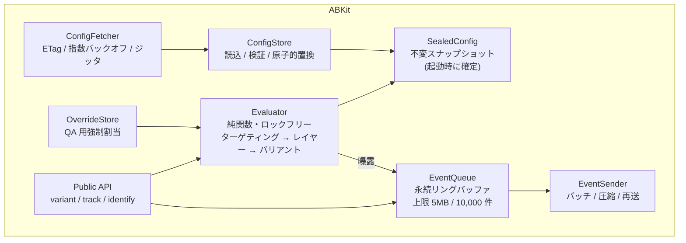

# 04. クライアント SDK 設計（iOS / Android）

## 1. 設計原則

1. **評価は純関数。** `variant(key)` は I/O をせず、ロックも取らず、必ず値を返す。失敗しない。
2. **セッション内で不変。** 起動時に確定したコンフィグをセッション終了まで使う（[ADR-0005](adr/0005-session-sealed-config.md)）。
3. **起動をブロックしない。** `start()` は同期部分 10ms 未満で戻る。ネットワークは常にバックグラウンド。
4. **未知のものは安全側に倒す。** 未知のフラグ・未知のバリアント・壊れた JSON → すべてデフォルト値（C1）。
5. **依存ゼロ。** ホストアプリのライブラリと衝突しない。

## 2. 公開 API

### Swift

```swift
// AppDelegate / App.init — 起動最速のタイミングで
ABKit.start(
    ABKitConfiguration(
        appKey: "ios-prod-8f2c...",
        environment: .production,
        // ビルド時に埋め込むデフォルト（初回起動用・C6 対策）
        bundledDefaults: Bundle.main.url(forResource: "abkit-defaults", withExtension: "json"),
        // 任意: 端末属性以外のターゲティング用アトリビュート
        attributes: ["plan": "free"]
    )
)

// 評価: 同期・非失敗
let v = ABKit.variant("checkout_button_v2")
if v.isTreatment { showNewCheckout() }

// パラメータ付きフラグ（推奨形）
let color   = v.string("button_color", default: "#0A84FF")
let maxItem = v.int("max_items", default: 20)

// 型安全アクセサ（実験レジストリからコード生成）
if ABKit.experiments.checkoutButtonV2.isTreatment { ... }

// ログイン時: user_id 単位の実験をここで初めて評価可能にする
ABKit.identify(userId: "u_12345")

// 明示的な曝露（遅延曝露パターン。§6 参照）
ABKit.trackExposure("checkout_button_v2")

// メトリクスイベント
ABKit.track("purchase_completed", properties: ["revenue_jpy": 4980])
```

### Kotlin

```kotlin
// Application.onCreate()
ABKit.start(
    context,
    ABKitConfig(
        appKey = "android-prod-3b91...",
        environment = Environment.PRODUCTION,
        bundledDefaultsRes = R.raw.abkit_defaults,
        attributes = mapOf("plan" to "free"),
    ),
)

val v = ABKit.variant("checkout_button_v2")
if (v.isTreatment) showNewCheckout()

val color = v.string("button_color", default = "#0A84FF")
val maxItem = v.int("max_items", default = 20)

if (ABKit.experiments.checkoutButtonV2.isTreatment) { /* ... */ }

ABKit.identify(userId = "u_12345")
ABKit.track("purchase_completed", mapOf("revenue_jpy" to 4980))
```

### API に関する判断

| 判断 | 理由 |
|---|---|
| 評価 API に `async` を使わない | 呼び出し側が UI スレッドの分岐で使う。`await` を強制すると SwiftUI の `body` や `onCreateView` で使えず、結局アプリ側でキャッシュ層を作られてしまう |
| `Bool` ではなく `Variant` を返す | A/B/n に自然に拡張できる。パラメータを同じ経路で運べる |
| デフォルト値を呼び出し側に必須で書かせる | SDK が壊れてもアプリが壊れないことをコード上で保証する。デフォルトを SDK 内に隠すと C1 の前方互換要件を満たせない |
| グローバルシングルトン | 実験基盤はアプリ全体で一意。DI で引き回すコストに見合わない。ただしテスト用に `ABKit.Testing.withOverrides { }` を用意する |

## 3. 内部構成



### スレッドモデル

| コンポーネント | スレッド |
|---|---|
| `variant()` の評価 | 呼び出し元スレッド。`SealedConfig` は不変なので同期不要 |
| コンフィグのロード（起動時） | 呼び出し元スレッド（同期）。ただし mmap + 遅延パースで 10ms 未満 |
| フェッチ | 専用バックグラウンドキュー |
| イベントのエンキュー | ロックフリーキューへ投入のみ。ディスク書き込みは別スレッドでバッチ |
| 送信 | バックグラウンド（iOS: background `URLSession` / Android: `WorkManager`） |

`SealedConfig` を**不変オブジェクトの原子的差し替え**にすることで、評価パスから一切のロックを外す。これが「10ms 未満」と「UI スレッドで呼べる」を同時に満たす鍵。

## 4. 起動シーケンスと C6（コールドスタート）への対処

```
start() 呼び出し
  ├─ 1. install_id をロード（なければ採番して永続化）        ~1ms
  ├─ 2. ローカルキャッシュのコンフィグをロード
  │      ├─ あり → 検証（バージョン・署名・スキーマ）→ 採用
  │      └─ なし → バイナリ同梱デフォルトを採用（source=bundled）
  ├─ 3. SealedConfig を構築して原子的に公開                  ~3ms
  ├─ 4. return（ここまで同期・メインスレッド）
  └─ 5. 以降バックグラウンド:
         ├─ コンフィグをフェッチ → 検証 → ディスク保存（次回起動から有効）
         └─ 前回セッションの未送信イベントを再送
```

### 初回起動実験の扱い

初回起動時にはネットワークからのコンフィグがない。これに対する選択肢と本設計の答え:

| 案 | 評価 |
|---|---|
| フェッチ完了まで UI を止める | ❌ 起動時間が悪化し、電波の弱いユーザで最悪。そもそも C6 の解にならない |
| フェッチ完了後に途中でバリアントを切り替える | ❌ UI がちらつく。曝露の意味が壊れる |
| **バイナリ同梱コンフィグで評価し、その旨を記録** | ✅ 採用 |

**運用ルール:** 「初回セッションから効かせたい実験」は、アプリのリリースビルド時点でコンフィグに含まれている必要がある。CI でリリースブランチのビルド時に最新コンフィグをスナップショットして `abkit-defaults.json` として同梱する。この制約は C1 の直接の帰結であり、回避策はない。曝露イベントには `config_source: "bundled" | "cached" | "fetched"` を必ず載せ、解析時に区別する。

## 5. 評価アルゴリズム

```
evaluate(key, sealedConfig, context) -> Variant:
  1. QA オーバーライドがあれば即返す（曝露は送るが is_override=true を付与）
  2. flag = config.flags[key];  無ければ default を返す（reason=FLAG_NOT_FOUND）
  3. flag が kill されていれば default（reason=KILLED）
  4. ターゲティング評価:
       - app_version が範囲外        → default (reason=OUT_OF_VERSION_RANGE)
       - platform / locale / country / custom attributes 不一致 → default (reason=NOT_TARGETED)
       - 事前条件実験（依存）を満たさない → default (reason=DEPENDENCY_NOT_MET)
  5. ランダム化単位を解決:
       - unit = user_id / install_id / session_id
       - user_id 指定で未 identify → default (reason=UNIT_UNAVAILABLE)
  6. レイヤー割当:
       b_layer = bucket(layer.salt, unit)
       実験のレイヤー内レンジ [start, end) に入らなければ default (reason=NOT_IN_LAYER)
  7. バリアント割当:
       b_var = bucket(experiment.salt, unit)     # ★ レイヤーとは別 salt（独立性のため）
       累積レンジ探索でバリアント決定
  8. スティッキー割当が有効なら、保存済み割当を優先（§7）
  9. 曝露イベントを記録（セッション内で (key, variant) 単位に重複排除）
 10. Variant を返す
```

`reason` を必ず返す設計にしている。「なぜこのユーザは treatment にならないのか」は運用で最も多い問い合わせで、これがないとデバッグ不能になる。デバッグメニューで全フラグの `reason` を一覧表示できるようにする。

バケッティングの規範仕様は [spec/bucketing.md](../spec/bucketing.md)、検証は [spec/golden-vectors.json](../spec/golden-vectors.json)。

## 6. 曝露（exposure）イベント

**曝露とは「そのユーザが実験の影響を実際に受けた」という記録**であり、解析の分母になる。ここを間違えると全実験の統計が壊れるので、最も慎重に設計する。

### 原則: 評価した時点で曝露

`variant()` を呼んだ瞬間に曝露を記録する。ただしこれには落とし穴がある。

**問題:** アプリ起動時に全フラグをまとめて評価してキャッシュすると、その画面に到達していないユーザまで曝露にカウントされる。分母が水増しされ、効果が希釈される（検出力が落ちる）。

**対策:** 2 つのパターンを用意し、使い分けを明文化する。

| パターン | API | 使いどころ |
|---|---|---|
| 即時曝露（既定） | `variant(key)` | 分岐した直後に必ずユーザが影響を受ける場合 |
| 遅延曝露 | `variant(key, trackExposure: false)` → 実際に表示された時点で `trackExposure(key)` | 事前に評価するが、表示されるか分からない場合（画面遷移の先、A/B する UI が下スクロール位置にある等） |

### 重複排除

- セッション内では `(experiment_key, variant)` ごとに 1 回だけ送出。
- サーバ側では `event_id`（クライアント生成 UUIDv7）で冪等排除。
- 解析側では「ユーザ × 実験 × 日」で最初の曝露のみを採用。

### 曝露が発生しないケースの記録

`reason != ASSIGNED` の評価も、**サンプリングして**（例: 1%）送る。「ターゲティングから外れている理由の分布」は実験設定ミスの発見に極めて有効。全件送るとイベント量が跳ねるのでサンプリングする。

## 7. スティッキー割当

ロールアウト率を 10% → 5% に下げたとき、既に treatment を見ていたユーザの体験を戻すべきか。

- **既定: 戻す（非スティッキー）。** 単純で、割当が常にコンフィグから再現可能。
- **オプション: 維持する（スティッキー）。** UI の大きな変更で、行き来するとユーザが混乱する実験に使う。

スティッキー時は端末に `{experiment_key: {variant, assigned_at, config_version}}` を永続化し、評価時に優先する。ただし:

- 実験の `seed` が変わったら保存を破棄する（再ランダム化の意図を尊重）。
- バリアント自体が削除されていたら破棄してデフォルトへ。
- 複数端末で一貫させたい場合は端末保存では足りず、`assignment-service` のサーバ側スティッキーストアを使う（[05 章](05-services.md)）。

## 8. イベントキューと送信

| 項目 | 設計 |
|---|---|
| 保存形式 | 追記専用ファイル（JSONL + zstd フレーム）。SQLite は依存とサイズが重い |
| 上限 | 5MB または 10,000 件。超過時は**古いものから捨てる**（新しいイベントのほうが価値が高い） |
| 送信トリガ | ①20 件溜まる ②30 秒経過 ③アプリがバックグラウンドへ遷移 ④明示 `flush()` |
| バックグラウンド遷移時 | iOS: `beginBackgroundTask` で最大 30 秒の猶予内に送信。失敗時は background `URLSession` に委譲 |
| 圧縮 | zstd（level 3）。無理なら gzip |
| 再送 | 指数バックオフ（1s → 最大 5 分）+ フルジッタ。**429/503 の `Retry-After` を必ず尊重する** |
| 起動時スパイク対策 | 全端末が一斉に起動する時間帯（プッシュ通知直後）に備え、初回送信に 0〜10 秒のランダム遅延 |
| 電池・通信量 | 低電力モード時は送信間隔を延長。従量課金回線（Android の `isActiveNetworkMetered`）でも送るが圧縮率を優先 |

## 9. コンフィグ取得

```http
GET /v1/config?app_id=com.example.app&platform=ios&app_version=5.12.0&sdk_version=1.4.0
If-None-Match: "8421"
Accept-Encoding: gzip
```

| 項目 | 設計 |
|---|---|
| キャッシュ | `ETag` + `If-None-Match`。304 が大半になる |
| CDN 設定 | `Cache-Control: public, max-age=30, stale-while-revalidate=300, stale-if-error=86400` |
| タイムアウト | 接続 5 秒 / 全体 10 秒 |
| リトライ | 3 回、指数バックオフ + ジッタ。失敗しても**アプリの動作に影響しない** |
| フェッチ契機 | `start()` 直後、フォアグラウンド復帰時（前回から 15 分以上経過している場合のみ） |
| 検証 | ①JSON Schema ②`config_version` が現在より新しい ③Ed25519 署名（任意だが推奨） |
| サイズ | 目標 < 100KB（gzip 後）。超えたらサーバ側でプラットフォーム・バージョン別の絞り込みを強化する |

**署名について:** コンフィグは CDN 経由で HTTPS 配信されるが、企業 MDM の SSL インスペクションなどで中間者が存在しうる。改ざんされたコンフィグは「意図しない機能の有効化」を引き起こすので、公開鍵をアプリに埋め込んで Ed25519 で検証する。鍵ローテーションのため、アプリには 2 つの公開鍵を埋め込んでおく。

## 10. QA・デバッグ機能

これがないと実験基盤は現場で使われない。必須機能として扱う。

| 機能 | 内容 |
|---|---|
| デバッグメニュー | 全フラグの現在値・`reason`・`config_version`・`unit_id` を一覧表示 |
| バリアント強制 | メニューまたはディープリンク `myapp://abkit/override?exp=checkout_button_v2&variant=treatment` |
| コンフィグ強制リロード | キャッシュ破棄 + 即時フェッチ + 即時シール（QA 時のみセッションシールを破る） |
| プレビュー環境切替 | `staging` コンフィグの取得 |
| 曝露ログのローカル表示 | 送信されたイベントをその場で確認 |
| 有効化 | デバッグビルドは常時、リリースビルドは隠しジェスチャ + 社内 ID 検証（**外部ユーザが触れないこと**） |

## 11. テスト戦略

| レイヤ | 内容 |
|---|---|
| ゴールデンベクタ適合 | [spec/golden-vectors.json](../spec/golden-vectors.json) を Swift / Kotlin / Go / Python の全実装の CI で実行。**不一致ならマージ不可** |
| 分布テスト | 10 万件の合成 ID で χ² 検定。一様性を検証 |
| 前方互換テスト | 未知のフラグ型・未知のバリアント・未知のオペレータを含むコンフィグを食わせ、クラッシュせずデフォルトを返すことを検証（C1） |
| 破損耐性テスト | 途中で切れた JSON、ゼロバイトファイル、不正な署名 → バイナリ同梱デフォルトへフォールバック |
| 起動時間の回帰 | `start()` の実測を CI で計測、10ms を超えたら失敗 |
| バイナリサイズの回帰 | 300KB を超えたら失敗 |
| A/A テスト | 本番で常時 2 本の A/A 実験を走らせ、偽陽性率が名目水準に収まることを監視（[07 章](07-statistics.md)） |
