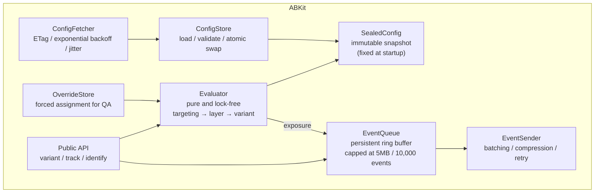

**English** · [日本語](04-client-sdk-ja.md)

# 04. Client SDK design (iOS and Android)

## 1. Design principles

1. **Evaluation is a pure function.** `variant(key)` performs no input or output, takes no lock, and always returns a value. It cannot fail.
2. **The configuration is immutable within a session.** The software development kit (SDK) uses the configuration fixed at startup until the session ends ([BK-0005](../roadmaps/BK-0005-session-sealed-config/BK-0005-session-sealed-config.md)).
3. **Startup is never blocked.** The synchronous part of `start()` returns in under 10 ms, and the network is always background work.
4. **Anything unknown falls to the safe side.** An unknown flag, an unknown variant, or malformed JSON all yield the default value (constraint C1).
5. **No dependencies.** The SDK never clashes with a library in the host app.

## 2. The public API

### Swift

```swift
// AppDelegate / App.init — as early in startup as possible
ABKit.start(
    ABKitConfiguration(
        appKey: "ios-prod-8f2c...",
        environment: .production,
        // Defaults embedded at build time, for the first launch (constraint C6)
        bundledDefaults: Bundle.main.url(forResource: "abkit-defaults", withExtension: "json"),
        // Optional: attributes for targeting beyond the device's own properties
        attributes: ["plan": "free"]
    )
)

// Evaluation: synchronous and infallible
let v = ABKit.variant("checkout_button_v2")
if v.isTreatment { showNewCheckout() }

// A flag with parameters (the recommended shape)
let color   = v.string("button_color", default: "#0A84FF")
let maxItem = v.int("max_items", default: 20)

// Type-safe accessors, generated from the experiment registry
if ABKit.experiments.checkoutButtonV2.isTreatment { ... }

// At login: this is where experiments keyed on user_id first become evaluable
ABKit.identify(userId: "u_12345")

// An explicit exposure (the deferred-exposure pattern; see §6)
ABKit.trackExposure("checkout_button_v2")

// A metric event
ABKit.track("purchase_completed", properties: ["revenue_jpy": 4980])
```

### Kotlin

```kotlin
// Application.onCreate()
ABKit.start(
    context,
    ABKitConfig(
        appKey = "android-prod-3b91...",
        environment = Environment.PRODUCTION,
        bundledDefaultsRes = R.raw.abkit_defaults,
        attributes = mapOf("plan" to "free"),
    ),
)

val v = ABKit.variant("checkout_button_v2")
if (v.isTreatment) showNewCheckout()

val color = v.string("button_color", default = "#0A84FF")
val maxItem = v.int("max_items", default = 20)

if (ABKit.experiments.checkoutButtonV2.isTreatment) { /* ... */ }

ABKit.identify(userId = "u_12345")
ABKit.track("purchase_completed", mapOf("revenue_jpy" to 4980))
```

### The decisions behind the API

| Decision | Reason |
|---|---|
| The evaluation API is not `async` | Callers branch on it from the user-interface thread. Forcing an `await` makes it unusable inside a SwiftUI `body` or `onCreateView`, and the app ends up building a cache layer of its own |
| It returns a `Variant` rather than a `Bool` | A `Variant` extends naturally to A/B/n, and it carries parameters along the same path |
| The caller must always write the default value | It guarantees in code that a broken SDK cannot break the app. Hiding the default inside the SDK fails the forward-compatibility requirement in constraint C1 |
| A global singleton | An experimentation platform is unique within an app, so threading it through dependency injection does not pay. For tests the SDK provides `ABKit.Testing.withOverrides { }` |

## 3. Internal structure



### The threading model

| Component | Thread |
|---|---|
| Evaluation in `variant()` | The calling thread. `SealedConfig` is immutable, so no synchronization is needed |
| Loading the configuration at startup | The calling thread, synchronously, but under 10 ms thanks to mmap and lazy parsing |
| Fetching | A dedicated background queue |
| Enqueuing an event | Only a push onto a lock-free queue. Writing to disk happens in batches on another thread |
| Sending | Background: a background `URLSession` on iOS, `WorkManager` on Android |

Making `SealedConfig` an **immutable object swapped atomically** removes every lock from the
evaluation path. That property is the key to satisfying "under 10 ms" and "callable from the
user-interface thread" at the same time.

## 4. The startup sequence, and the answer to C6 (cold start)

```
start() is called
  ├─ 1. Load install_id (generate and persist it if absent)         ~1ms
  ├─ 2. Load the cached configuration
  │      ├─ present → validate (version, signature, schema) → adopt
  │      └─ absent  → adopt the defaults bundled in the binary (source=bundled)
  ├─ 3. Build SealedConfig and publish it atomically                ~3ms
  ├─ 4. return (everything above is synchronous, on the main thread)
  └─ 5. From here on, in the background:
         ├─ fetch the configuration → validate → save to disk (effective from the next launch)
         └─ retransmit the previous session's unsent events
```

### Handling an experiment that must run on the first launch

On a first launch no configuration has arrived from the network. The options, and this design's
answer:

| Option | Assessment |
|---|---|
| Block the user interface until the fetch completes | ❌ Startup time degrades, worst of all for users on weak signal. It does not answer constraint C6 anyway |
| Switch the variant partway through, once the fetch completes | ❌ The user interface flickers, and the meaning of an exposure breaks |
| **Evaluate against the bundled configuration and record that fact** | ✅ Selected |

**The operating rule:** an experiment that must take effect from the first session must be in the
configuration as of the app's release build. Continuous integration snapshots the latest
configuration when building the release branch and bundles it as `abkit-defaults.json`. This
constraint follows directly from C1 and has no workaround. Every exposure event carries
`config_source: "bundled" | "cached" | "fetched"` so that analysis can tell the cases apart.

## 5. The evaluation algorithm

```
evaluate(key, sealedConfig, context) -> Variant:
  1. If a QA override exists, return it immediately (still emit the exposure, with is_override=true)
  2. flag = config.flags[key];  if absent, return the default (reason=FLAG_NOT_FOUND)
  3. If the flag is killed, return the default (reason=KILLED)
  4. Evaluate targeting:
       - app_version outside the range        → default (reason=OUT_OF_VERSION_RANGE)
       - platform / locale / country / custom attributes do not match → default (reason=NOT_TARGETED)
       - a prerequisite experiment (dependency) is unmet → default (reason=DEPENDENCY_NOT_MET)
  5. Resolve the randomization unit:
       - unit = user_id / install_id / session_id
       - user_id requested but identify() has not been called → default (reason=UNIT_UNAVAILABLE)
  6. Layer assignment:
       b_layer = bucket(layer.salt, unit)
       if it falls outside the experiment's range [start, end) within the layer → default (reason=NOT_IN_LAYER)
  7. Variant assignment:
       b_var = bucket(experiment.salt, unit)     # ★ a different salt from the layer's, for independence
       walk the cumulative ranges to pick the variant
  8. If sticky assignment is enabled, a stored assignment wins (§7)
  9. Record the exposure event (deduplicated per (key, variant) within the session)
 10. Return the Variant
```

The design always returns a `reason`. "Why is this user not in treatment?" is the most common
question operations receives, and without a `reason` the question cannot be answered. The debug
menu lists the `reason` for every flag.

The normative specification for bucketing is [spec/bucketing.md](../spec/bucketing.md), and the
verification data is [spec/golden-vectors.json](../spec/golden-vectors.json).

## 6. Exposure events

**An exposure records that a user was actually affected by an experiment**, and it becomes the
denominator of the analysis. Getting it wrong breaks the statistics of every experiment, so it
deserves the most careful design in the SDK.

### The principle: exposure happens at evaluation

An exposure is recorded the moment `variant()` is called. That principle has a trap in it.

**The problem:** evaluating every flag at app startup and caching the results counts users as
exposed even though they never reached the screen in question. The denominator inflates, the effect
dilutes, and statistical power drops.

**The answer:** provide two patterns and write down which to use when.

| Pattern | API | Where it fits |
|---|---|---|
| Immediate exposure (default) | `variant(key)` | The user is certainly affected right after the branch |
| Deferred exposure | `variant(key, trackExposure: false)`, then `trackExposure(key)` at the point of display | Evaluation happens early but display is uncertain — beyond a screen transition, or below the fold |

### Deduplication

- Within a session, each `(experiment_key, variant)` pair is emitted once.
- On the server, `event_id` (a client-generated UUIDv7) removes duplicates idempotently.
- During analysis, only the first exposure per user, experiment, and day counts.

### Recording the cases where no exposure occurs

Evaluations with `reason != ASSIGNED` are also sent, **but sampled** — at 1%, for instance. The
distribution of reasons for falling outside targeting is extremely effective at surfacing a
misconfigured experiment. Sending every one of them would spike the event volume, hence the sampling.

## 7. Sticky assignment

When a rollout drops from 10% to 5%, should users who already saw the treatment be moved back?

- **Default: move them back (non-sticky).** It is simpler, and the assignment stays reproducible from the configuration alone.
- **Optional: keep them (sticky).** This fits an experiment with a large user-interface change, where moving back and forth confuses the user.

Under sticky assignment the device persists
`{experiment_key: {variant, assigned_at, config_version}}` and prefers it at evaluation. Three rules
bound that behavior:

- Discard the stored assignment when the experiment's `seed` changes, which respects the intent to re-randomize.
- Discard it and fall back to the default when the variant itself has been removed.
- Device storage is not enough when the assignment must hold across a user's devices; that case uses the server-side sticky store in `assignment-service` ([chapter 05](05-services.md)).

## 8. The event queue and transmission

| Item | Design |
|---|---|
| Storage format | An append-only file (JSONL in zstd frames). SQLite costs too much in dependencies and size |
| Capacity | 5 MB or 10,000 events. On overflow, **the oldest go first**, because newer events are worth more |
| Send triggers | 20 events queued; 30 seconds elapsed; the app moving to the background; an explicit `flush()` |
| On moving to the background | iOS sends within the grace period of up to 30 seconds from `beginBackgroundTask`, delegating to a background `URLSession` on failure |
| Compression | zstd at level 3, falling back to gzip |
| Retry | Exponential backoff from 1 second to 5 minutes, with full jitter. **`Retry-After` on a 429 or 503 is always honored** |
| Guarding against startup spikes | The first send is delayed by a random 0 to 10 seconds, for the periods when every device starts at once — right after a push notification, for example |
| Battery and data | The interval lengthens in low-power mode. On a metered connection (`isActiveNetworkMetered` on Android) events still go out, but compression takes priority |

## 9. Fetching the configuration

```http
GET /v1/config?app_id=com.example.app&platform=ios&app_version=5.12.0&sdk_version=1.4.0
If-None-Match: "8421"
Accept-Encoding: gzip
```

| Item | Design |
|---|---|
| Caching | `ETag` with `If-None-Match`. Most responses become 304 |
| CDN settings | `Cache-Control: public, max-age=30, stale-while-revalidate=300, stale-if-error=86400` |
| Timeouts | 5 seconds to connect, 10 seconds overall |
| Retry | Three attempts with exponential backoff and jitter. A failure **does not affect how the app behaves** |
| When a fetch happens | Right after `start()`, and on returning to the foreground, but only if 15 minutes have passed since the last fetch |
| Validation | The JSON Schema; a `config_version` newer than the current one; an Ed25519 signature, which is optional but recommended |
| Size | Under 100 KB after gzip. Beyond that, tighten the server-side split by platform and version |

**On signatures:** configuration travels over HTTPS through a content delivery network, but a
middlebox can still sit in the path — corporate mobile device management performing TLS inspection,
for example. A tampered configuration would enable features nobody intended, so the app embeds a
public key and verifies an Ed25519 signature. The app embeds two public keys so that a key can be
rotated.

## 10. Quality assurance and debugging

Without these features an experimentation platform does not get used in practice. Treat them as
mandatory.

| Feature | Contents |
|---|---|
| Debug menu | Lists every flag's current value, `reason`, `config_version`, and `unit_id` |
| Forcing a variant | Through the menu, or a deep link such as `myapp://abkit/override?exp=checkout_button_v2&variant=treatment` |
| Forced configuration reload | Discard the cache, fetch immediately, and reseal immediately, breaking the session seal for quality assurance only |
| Switching to a preview environment | Fetching the `staging` configuration |
| Local view of the exposure log | Inspecting the events that were sent, without leaving the app |
| Enabling these features | Always on in debug builds; behind a hidden gesture plus an internal identity check in release builds, so that **no external user can reach it** |

## 11. Test strategy

| Layer | Contents |
|---|---|
| Golden-vector conformance | Run [spec/golden-vectors.json](../spec/golden-vectors.json) in continuous integration for every implementation — Swift, Kotlin, Go, and Python. **A mismatch blocks the merge** |
| Distribution test | A chi-squared test over 100,000 synthetic identifiers, verifying uniformity |
| Forward-compatibility test | Feed a configuration containing an unknown flag type, an unknown variant, and an unknown operator, and verify that the SDK returns defaults without crashing (constraint C1) |
| Corruption tolerance | Truncated JSON, a zero-byte file, and an invalid signature all fall back to the defaults bundled in the binary |
| Startup-time regression | Measure `start()` in continuous integration and fail past 10 ms |
| Binary-size regression | Fail past 300 KB |
| A/A test | Run two A/A experiments continuously in production and monitor that the false-positive rate stays at its nominal level ([chapter 07](07-statistics.md)) |
