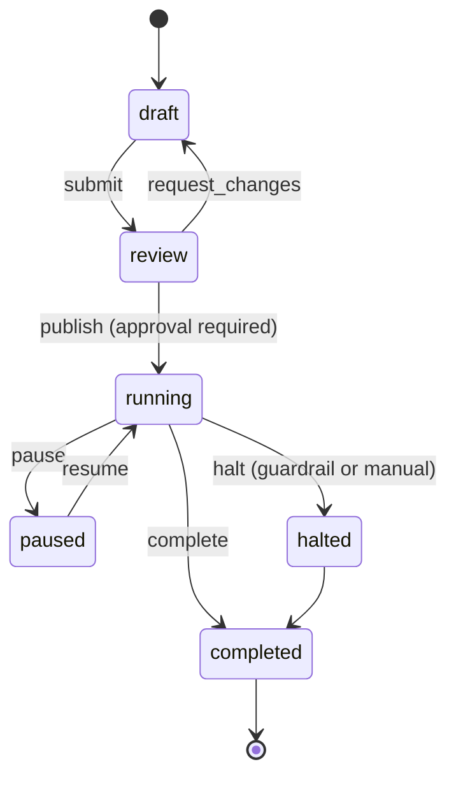

**English** · [日本語](05-services-ja.md)

# 05. Server-side service design

## The services

| Service | Plane | Language | Main store | Phase |
|---|---|---|---|---|
| [config-edge](#1-config-edge) | Data | Go | Redis / S3 | 1 |
| [event-gateway](#2-event-gateway) | Data | Go | Kafka | 1 |
| [experiment-service](#3-experiment-service) | Control | Go | PostgreSQL | 1 |
| [metric-service](#4-metric-service) | Control | Go | PostgreSQL / Git | 1 |
| [config-builder](#5-config-builder) | Control | Go | S3 / Redis | 1 |
| [stats-service](#6-stats-service) | Analysis | Python | ClickHouse | 1 |
| [console](#7-console) | Control | TypeScript | — | 1 |
| [assignment-service](#8-assignment-service-phase-2) | Data | Go | Redis + DynamoDB | 2 |
| [guardrail-watcher](#9-guardrail-watcher-phase-2) | Analysis | Go | ClickHouse | 2 |

In Phase 1, experiment-service, metric-service, config-builder, and the console's backend for
frontend ship as a **single deployment unit**
([chapter 02 §4](02-architecture.md#4-how-the-services-are-split)). Read what follows as a split of
responsibilities, not of processes.

---

## 1. config-edge

**Responsibility:** serve the compiled configuration. Nothing else.

```
GET /v1/config?app_id=&platform=&app_version=&sdk_version=
  → 200 application/json (ETag, gzip)  /  304
GET /healthz
```

| Design item | Contents |
|---|---|
| Stateless | An instance touches only Redis and S3, and every instance answers identically |
| Key resolution | Look the object up by `(app_id, platform, sdk_version_major)`. Filtering by `app_version` **is done at build time**, which minimizes branching at request time |
| Response | Read from Redis; on a miss, read S3; if that fails too, **return the last successful response from the in-process LRU cache** |
| ETag | Determined by `config_version` alone, which is safe because objects are immutable |
| Rate limiting | Per app key, though the CDN absorbs most traffic and little reaches the origin |
| CDN settings | `public, max-age=30, stale-while-revalidate=300, stale-if-error=86400` |

**The property that matters: this service holds no database.** Configuration delivery continues even
if PostgreSQL is entirely lost, and that structure is how the service reaches 99.99% availability.

**Capacity estimate:** 10 million monthly active users fetching three times a day gives 30 million
requests per day. At a 95% CDN hit rate — most of the rest being 304 responses — the origin sees
1.5 million requests per day, about 17 requests per second at rest and 200 at peak. Two Go instances
suffice. The CDN carries the real load.

---

## 2. event-gateway

**Responsibility:** accept events and put them on Kafka. It validates but does not transform.

```
POST /v1/events
Content-Encoding: zstd
Authorization: Bearer <app_key>
{ "sent_at": "...", "batch_id": "...", "events": [ ... ] }
  → 202 Accepted { "accepted": 20, "rejected": 0 }
```

| Design item | Contents |
|---|---|
| Acceptance first | Only events that pass validation go to Kafka, and **a partial failure still returns 202**, because making the client retransmit only multiplies duplicates |
| Validation | A JSON Schema ([spec/event.schema.json](../spec/event.schema.json)) plus size limits: 32 KB per event, 1 MB per batch |
| Enrichment | `server_ts`, `ingest_id`, and the country code resolved from the IP address. **The address itself is discarded immediately and never stored** |
| Clock correction | Estimate the skew from the difference between the batch's `sent_at` and `server_ts`, and attach `corrected_ts` ([chapter 06](06-data-pipeline.md)) |
| Backpressure | When Kafka backs up, spool to local disk; when that overflows too, return 429 with `Retry-After` |
| Authentication | The app key, embedded in the client and not a secret. **Impersonation is handled by anomaly detection rather than authentication** — the gateway watches for bulk submission from a single address and for a spike in identifiers that do not exist |
| Partitioning | Partition by a hash of `unit_id`, which preserves event order per user |

**A client's app key cannot be kept secret**, since it can be extracted from an APK or IPA. The
design starts from that fact and protects the endpoint through write-only access, rate limiting, and
anomaly detection. Trying to protect it through authentication always fails.

---

## 3. experiment-service

**Responsibility:** the single source of truth for experiment definitions and their lifecycle.

### The data model

```sql
CREATE TABLE layers (
  key             TEXT PRIMARY KEY,           -- 'checkout'
  salt            TEXT NOT NULL,              -- 'layer:checkout:1'
  total_buckets   INT  NOT NULL DEFAULT 10000
);

CREATE TABLE experiments (
  id              UUID PRIMARY KEY,
  key             TEXT UNIQUE NOT NULL,       -- 'checkout_button_v2'
  layer_key       TEXT REFERENCES layers(key),
  layer_range     INT4RANGE,                  -- the bucket range occupied within the layer
  seed            INT  NOT NULL DEFAULT 1,    -- for re-randomization
  randomization_unit TEXT NOT NULL,           -- install_id | user_id | account_id | session_id
  sticky          BOOLEAN NOT NULL DEFAULT FALSE,
  state           TEXT NOT NULL,              -- draft|review|running|paused|halted|completed
  targeting       JSONB NOT NULL,             -- the condition tree
  variants        JSONB NOT NULL,             -- [{key, weight_bp, params}]
  primary_metric  TEXT NOT NULL,
  guardrails      TEXT[] NOT NULL,
  owner           TEXT NOT NULL,
  started_at      TIMESTAMPTZ,
  planned_end_at  TIMESTAMPTZ,
  created_at      TIMESTAMPTZ NOT NULL DEFAULT now(),
  -- ★ the database guarantees that bucket ranges never overlap within a layer
  EXCLUDE USING gist (layer_key WITH =, layer_range WITH &&)
      WHERE (state IN ('running','paused'))
);

CREATE TABLE experiment_audit (
  id          BIGSERIAL PRIMARY KEY,
  experiment_id UUID NOT NULL,
  actor       TEXT NOT NULL,
  action      TEXT NOT NULL,
  before      JSONB,
  after       JSONB,
  at          TIMESTAMPTZ NOT NULL DEFAULT now()
);

-- Transactional outbox (atomicity for the publish event)
CREATE TABLE outbox (
  id         BIGSERIAL PRIMARY KEY,
  topic      TEXT NOT NULL,
  payload    JSONB NOT NULL,
  published_at TIMESTAMPTZ
);
```

Layer exclusion through `EXCLUDE USING gist` is the keystone of the design. **Mutual exclusion is
guaranteed by a database constraint rather than by application logic**, which structurally prevents
the accident where a race between two simultaneous publications double-allocates a range of buckets.

### The lifecycle and its invariants



Validation at publication, every check a hard gate:
- The variants' `weight_bp` values sum to the width of `layer_range`.
- `primary_metric` exists in metric-service and is enabled.
- At least one guardrail is present; crash rate is attached automatically.
- Once an experiment is `running`, its `seed`, its `randomization_unit`, and its variant composition **cannot change**. Changing any of them means creating a new experiment. Only an **increase** in traffic allocation is permitted; a decrease carries a warning, because the treatment of existing subjects turns ambiguous.
- App-version targeting is specified, which enforces constraint C1.

### The API (gRPC and REST)

```
POST   /v1/experiments                    create
PATCH  /v1/experiments/{id}               update (large changes only while in draft)
POST   /v1/experiments/{id}:publish       publish
POST   /v1/experiments/{id}:halt          emergency stop
GET    /v1/experiments?state=running
GET    /v1/experiments/{id}/audit
```

---

## 4. metric-service

**Responsibility:** managing metric definitions. The point of the service is that **definitions live
in Git and go through pull-request review**.

```yaml
# metrics/purchase_conversion.yaml
key: purchase_conversion
name: Purchase conversion rate
type: proportion            # proportion | mean | ratio | count | quantile
owner: growth-team
description: The share of exposed users with at least one purchase_completed within 7 days
unit: user
numerator:
  event: purchase_completed
  window: 7d
denominator:
  type: exposed_units
guardrail: false
minimum_detectable_effect: 0.02
```

```yaml
# metrics/app_start_time_p95.yaml
key: app_start_time_p95
type: quantile
quantile: 0.95
event: app_started
value_field: duration_ms
direction: lower_is_better
guardrail: true
alert_threshold_pct: 5      # halt automatically on a 5% regression
```

| Decision | Reason |
|---|---|
| Metric definitions in YAML under Git | Letting people define metrics freely in the user interface produces a crowd of subtly different "purchase rates", one per experiment, and results stop being comparable. Review keeps the definitions consistent |
| Callers do not write SQL | A ClickHouse schema change would break every metric definition at once. The service generates SQL from the abstract definition instead |
| `minimum_detectable_effect` is mandatory | It lets the platform compute the sample size when an experiment starts and answer "how many days until this concludes?" |

---

## 5. config-builder

**Responsibility:** compile experiment definitions, held as normalized relational data, into a
denormalized configuration the SDK can evaluate quickly.

### How the output is split

Putting every experiment in one file ships information the SDK never uses. The output splits like
this:

```
config/{version}/{app_id}/{platform}/{sdk_major}.json
```

- **By platform** — an iOS-only experiment does not go to Android.
- **By SDK major version** — a new targeting operator does not go to an old SDK, which is how forward compatibility is upheld.
- **Not by app version** — the combinations would explode. The configuration carries `min_version` and `max_version` instead, and the SDK decides.

### What compilation does

1. Fetch every `running` and `paused` experiment.
2. Normalize the targeting condition tree into primitives the SDK can evaluate, expanding segment references into concrete conditions.
3. Fix the bucket range for each layer.
4. **Exclude from a bundle** any experiment using an operator that `sdk_major` cannot understand, so it never reaches an old SDK.
5. Check the size: warn above 100 KB after gzip, fail the build at 200 KB.
6. **Self-check:** run the golden vectors and the regression tests against the generated configuration, and diff it against the previous version for unintended changes in assignment.
7. Put the immutable object to S3, swap the `latest.json` pointer, and purge the CDN.

Step 6 carries the weight. The accident it prevents is real: "we only meant to raise the allocation
from 10% to 20%, but the existing 10% got reshuffled too." **Before publication, compute what
share of users change assignment against the previous version, and show it in the user
interface.**

### Rollback

```
POST /v1/config:rollback  { "to_version": 8430 }
→ point latest.json back at the previous version and purge. Done in seconds.
```

Because the objects are immutable, every past version is still there. The recovery move is never
"fix the broken experiment" but always "go back to the version that worked".

---

## 6. stats-service

**Responsibility:** deciding experiment results statistically, in Python with FastAPI.

```
GET  /v1/experiments/{key}/results?as_of=2026-07-30&breakdown=app_version
POST /v1/experiments/{key}/power        sample size and required duration
GET  /v1/experiments/{key}/srm          sample ratio mismatch diagnostics
```

[Chapter 07](07-statistics.md) covers what the service computes. Three points matter in the
implementation:

- ClickHouse **pre-aggregates per bucket** (10,000 buckets × variant × day) before any statistics run. Raw events never reach Python.
- Results are cached for an hour, keyed by `(experiment, as_of, breakdown)`.
- The computation runs asynchronously as a Celery or Dagster job, and the API only serves the cache.

---

## 7. console

Next.js with the App Router, plus a backend for frontend.

| Screen | Contents |
|---|---|
| Experiment list | State, owner, days elapsed, and a sample-ratio-mismatch warning badge |
| Experiment detail | The settings, a visualization of the targeting, and **an up-front estimate of how many days this configuration needs to conclude** |
| Results | Effect size, confidence interval, and the sequential-test decision per metric. On a sample ratio mismatch the console **hides the results** ([chapter 07](07-statistics.md)) |
| Publication diff | The share of users whose assignment changes, shown before publishing |
| Flag inventory | Flags left `completed` for more than 90 days, which addresses constraint C2 |
| Audit log | Who changed what, and when |

---

## 8. assignment-service (Phase 2)

**Responsibility:** evaluating server-side experiments, and sticky assignment across a user's
devices.

```
POST /v1/assign        { unit, attributes, experiment_keys[] } → the assignments
GET  /v1/assignments/{unit_id}
```

- The evaluation logic uses **the same Go package** as config-builder and the SDK (`internal/eval`). Determinism collapses if those diverge.
- The sticky store is Redis with a 90-day time to live, backed by DynamoDB for persistence, read through the cache.
- Backend services can also use it as an embedded Go library (`abkit-go`), which gives them a path that avoids the network hop.

---

## 9. guardrail-watcher (Phase 2)

Every 15 minutes the watcher evaluates the guardrail metrics and, on detecting a significant
regression under a sequential test, calls `:halt` on experiment-service.

| Design item | Contents |
|---|---|
| Metrics watched | Crash rate, application-not-responding rate, p95 startup time, key conversion rates, and error rate |
| The test | **Always a sequential test**, because the watcher looks continuously. Running a fixed-horizon t-test every 15 minutes would produce false positives constantly |
| Condition for an automatic halt | Significant under the sequential test **and** past a practical effect-size threshold. Statistical significance alone does not halt an experiment |
| Guarding against a wrong halt | A halt only returns users to control, so recovery is easy. **Halting is cheap and not halting is expensive**, which justifies an aggressive threshold |
| Notification | Slack, with the metric, the confidence interval, and the variant involved |
