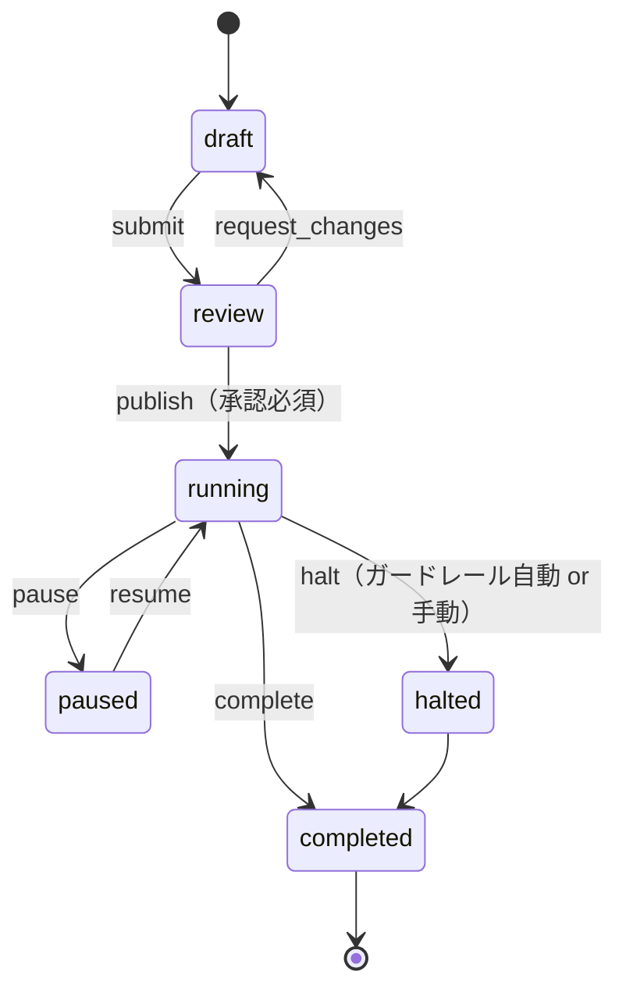

# 05. サーバサイド各サービス設計

## サービス一覧

| サービス | 平面 | 言語 | 主ストア | Phase |
|---|---|---|---|---|
| [config-edge](#1-config-edge) | データ | Go | Redis / S3 | 1 |
| [event-gateway](#2-event-gateway) | データ | Go | Kafka | 1 |
| [experiment-service](#3-experiment-service) | 制御 | Go | PostgreSQL | 1 |
| [metric-service](#4-metric-service) | 制御 | Go | PostgreSQL / Git | 1 |
| [config-builder](#5-config-builder) | 制御 | Go | S3 / Redis | 1 |
| [stats-service](#6-stats-service) | 解析 | Python | ClickHouse | 1 |
| [console](#7-console) | 制御 | TypeScript | — | 1 |
| [assignment-service](#8-assignment-service) | データ | Go | Redis + DynamoDB | 2 |
| [guardrail-watcher](#9-guardrail-watcher) | 解析 | Go | ClickHouse | 2 |

Phase 1 では experiment / metric / builder / console-BFF を**単一デプロイ単位**にまとめる（[02 章 §4](02-architecture.md#4-サービス分割の方針)）。以下は論理的な責務分割として読む。

---

## 1. config-edge

**責務:** コンパイル済みコンフィグを配る。それだけ。

```
GET /v1/config?app_id=&platform=&app_version=&sdk_version=
  → 200 application/json (ETag, gzip)  /  304
GET /healthz
```

| 設計項目 | 内容 |
|---|---|
| ステートレス | インスタンスは Redis と S3 しか触らない。どのインスタンスでも同じ応答 |
| キー解決 | `(app_id, platform, sdk_version_major)` でオブジェクトを引き、`app_version` によるフィルタは**ビルド時に済ませておく**（実行時分岐を最小化） |
| 応答 | Redis から取得 → ミス時 S3 → それも失敗なら**最後に成功した応答をプロセス内 LRU から返す** |
| ETag | `config_version` のみで決まる（オブジェクトが不変なので安全） |
| レート制限 | app_key 単位。ただし CDN で吸収されるのでオリジンへの到達は少ない |
| CDN 設定 | `public, max-age=30, stale-while-revalidate=300, stale-if-error=86400` |

**重要な性質:** このサービスは**DB を持たない**。PostgreSQL が全損してもコンフィグ配信は継続する。可用性 99.99% はこの構造で達成する。

**キャパシティ概算:** MAU 1000 万、1 日 3 回フェッチ → 3000 万 req/day。CDN ヒット率 95%（大半が 304）→ オリジン 150 万 req/day ≈ 17 rps 平常時、ピーク 200 rps。Go の 2 インスタンスで足りる。実質的な負荷は CDN が持つ。

---

## 2. event-gateway

**責務:** イベントを受理して Kafka に流す。検証はするが加工はしない。

```
POST /v1/events
Content-Encoding: zstd
Authorization: Bearer <app_key>
{ "sent_at": "...", "batch_id": "...", "events": [ ... ] }
  → 202 Accepted { "accepted": 20, "rejected": 0 }
```

| 設計項目 | 内容 |
|---|---|
| 受理優先 | 検証に通ったものだけ Kafka へ。**部分的な失敗でも 202 を返す**（クライアントに再送させると重複が増えるだけ） |
| 検証 | JSON Schema（[spec/event.schema.json](../spec/event.schema.json)）+ サイズ上限（1 イベント 32KB / バッチ 1MB） |
| 付加情報 | `server_ts`、`ingest_id`、IP からの国コード。**IP 本体は保存せず即破棄** |
| 時刻補正 | バッチの `sent_at` と `server_ts` の差から skew を推定し `corrected_ts` を付与（[06 章](06-data-pipeline.md)） |
| バックプレッシャ | Kafka が詰まったらローカルディスクにスプール。それも溢れたら 429 + `Retry-After` |
| 認証 | app_key（クライアント埋め込み。秘密ではない）。**なりすまし対策は認証ではなく異常検知で行う** — 単一 IP からの大量投入、存在しない `install_id` の急増を監視 |
| パーティション | `unit_id` のハッシュでパーティショニング。同一ユーザのイベント順序を保つ |

**クライアントの app_key は秘密にできない**（APK/IPA から取れる）。これを前提に、書き込み専用・レート制限・異常検知で守る設計にする。認証で守ろうとすると必ず破綻する。

---

## 3. experiment-service

**責務:** 実験の定義とライフサイクルの唯一の真実。

### データモデル

```sql
CREATE TABLE layers (
  key             TEXT PRIMARY KEY,           -- 'checkout'
  salt            TEXT NOT NULL,              -- 'layer:checkout:1'
  total_buckets   INT  NOT NULL DEFAULT 10000
);

CREATE TABLE experiments (
  id              UUID PRIMARY KEY,
  key             TEXT UNIQUE NOT NULL,       -- 'checkout_button_v2'
  layer_key       TEXT REFERENCES layers(key),
  layer_range     INT4RANGE,                  -- レイヤー内で占有するバケット範囲
  seed            INT  NOT NULL DEFAULT 1,    -- 再ランダム化用
  randomization_unit TEXT NOT NULL,           -- install_id | user_id | account_id | session_id
  sticky          BOOLEAN NOT NULL DEFAULT FALSE,
  state           TEXT NOT NULL,              -- draft|review|running|paused|halted|completed
  targeting       JSONB NOT NULL,             -- 条件木
  variants        JSONB NOT NULL,             -- [{key, weight_bp, params}]
  primary_metric  TEXT NOT NULL,
  guardrails      TEXT[] NOT NULL,
  owner           TEXT NOT NULL,
  started_at      TIMESTAMPTZ,
  planned_end_at  TIMESTAMPTZ,
  created_at      TIMESTAMPTZ NOT NULL DEFAULT now(),
  -- ★ 同一レイヤー内でバケット範囲が重ならないことを DB が保証する
  EXCLUDE USING gist (layer_key WITH =, layer_range WITH &&)
      WHERE (state IN ('running','paused'))
);

CREATE TABLE experiment_audit (
  id          BIGSERIAL PRIMARY KEY,
  experiment_id UUID NOT NULL,
  actor       TEXT NOT NULL,
  action      TEXT NOT NULL,
  before      JSONB,
  after       JSONB,
  at          TIMESTAMPTZ NOT NULL DEFAULT now()
);

-- Transactional Outbox（公開イベントの原子性）
CREATE TABLE outbox (
  id         BIGSERIAL PRIMARY KEY,
  topic      TEXT NOT NULL,
  payload    JSONB NOT NULL,
  published_at TIMESTAMPTZ
);
```

`EXCLUDE USING gist` によるレイヤー排他が設計上の要。**アプリケーションロジックではなく DB 制約で相互排他を保証する。** 同時公開のレースで実験が重複配分される事故を構造的に防ぐ。

### ライフサイクルと不変条件



公開時のバリデーション（すべてハードゲート）:
- バリアントの `weight_bp` の合計が `layer_range` の幅と一致する。
- `primary_metric` が metric-service に存在し、有効。
- ガードレールが最低 1 つ（クラッシュ率は自動付与）。
- `running` 以降は `seed` / `randomization_unit` / バリアント構成を**変更不可**（変更したければ新しい実験を作る）。トラフィック配分の**増加**のみ許可、減少は既存被験者の扱いが曖昧になるので警告付き。
- アプリバージョンターゲティングが指定されていること（C1 の強制）。

### API（gRPC + REST）

```
POST   /v1/experiments                    作成
PATCH  /v1/experiments/{id}               更新（draft のみ大幅変更可）
POST   /v1/experiments/{id}:publish       公開
POST   /v1/experiments/{id}:halt          緊急停止
GET    /v1/experiments?state=running
GET    /v1/experiments/{id}/audit
```

---

## 4. metric-service

**責務:** メトリクス定義の管理。**定義を Git 管理し PR レビューを通す**のが要点。

```yaml
# metrics/purchase_conversion.yaml
key: purchase_conversion
name: 購入完了率
type: proportion            # proportion | mean | ratio | count | quantile
owner: growth-team
description: 曝露後 7 日以内に purchase_completed が 1 件以上ある割合
unit: user
numerator:
  event: purchase_completed
  window: 7d
denominator:
  type: exposed_units
guardrail: false
minimum_detectable_effect: 0.02
```

```yaml
# metrics/app_start_time_p95.yaml
key: app_start_time_p95
type: quantile
quantile: 0.95
event: app_started
value_field: duration_ms
direction: lower_is_better
guardrail: true
alert_threshold_pct: 5      # 5% 悪化で自動停止
```

| 判断 | 理由 |
|---|---|
| メトリクス定義を YAML + Git | UI で自由に定義させると、実験ごとに微妙に違う「購入率」が乱立し結果が比較不能になる。レビューを挟むことで定義の一貫性を保つ |
| SQL を直接書かせない | ClickHouse のスキーマ変更でメトリクス定義が全部壊れる。抽象定義から SQL を生成する |
| `minimum_detectable_effect` を必須 | 実験開始時にサンプルサイズを計算し、「何日回せば結論が出るか」を提示するため |

---

## 5. config-builder

**責務:** 実験定義（正規化された関係データ）を、SDK が高速に評価できる非正規化コンフィグにコンパイルする。

### 分割戦略

すべての実験を 1 ファイルに入れると、SDK が使わない情報まで配る。以下で分割する:

```
config/{version}/{app_id}/{platform}/{sdk_major}.json
```

- **プラットフォーム別** — iOS 専用実験を Android に配らない。
- **SDK メジャーバージョン別** — 新しいターゲティングオペレータを古い SDK に配らない（前方互換の担保）。
- **アプリバージョン別には分けない** — 組合せが爆発する。代わりにコンフィグ内に `min_version` / `max_version` を持たせ SDK 側で判定する。

### コンパイル時にやること

1. `running` / `paused` の全実験を取得。
2. ターゲティング条件木を、SDK が評価できるプリミティブに正規化（セグメント参照 → 具体的な条件へ展開）。
3. レイヤーごとにバケット範囲を確定。
4. `sdk_major` が理解できないオペレータを含む実験は**そのバンドルから除外**（古い SDK には配らない）。
5. サイズチェック（gzip 後 100KB 超で警告、200KB でビルド失敗）。
6. **自己検証**: 生成したコンフィグに対しゴールデンベクタと回帰テストを走らせ、前版から意図しない割当変化がないか差分検査。
7. S3 に不変オブジェクトとして put → `latest.json` ポインタを差し替え → CDN purge。

ステップ 6 が重要。「トラフィック配分を 10%→20% に増やしただけのつもりが、既存の 10% の被験者もシャッフルされていた」という事故は実際に起きる。**公開前に、前版と比べて何 % のユーザの割当が変わるかを算出して UI に提示する。**

### ロールバック

```
POST /v1/config:rollback  { "to_version": 8430 }
→ latest.json を前版に戻して purge。数秒で完了。
```

不変オブジェクトなので過去の全バージョンがそのまま残っている。「壊れた実験を直す」のではなく「動いていた版に戻す」が常に可能。

---

## 6. stats-service

**責務:** 実験結果の統計判定。Python + FastAPI。

```
GET  /v1/experiments/{key}/results?as_of=2026-07-30&breakdown=app_version
POST /v1/experiments/{key}/power        サンプルサイズ・所要日数の計算
GET  /v1/experiments/{key}/srm          SRM 診断
```

計算内容は [07 章](07-statistics.md)。実装上の要点:

- ClickHouse で**バケット単位に事前集計**（10,000 バケット × バリアント × 日）してから統計処理する。生イベントを Python に持ってこない。
- 結果はキャッシュする（`(experiment, as_of, breakdown)` で 1 時間）。
- 計算は Celery / Dagster のジョブとして非同期実行し、API はキャッシュを返すだけにする。

---

## 7. console

Next.js（App Router）+ BFF。

| 画面 | 内容 |
|---|---|
| 実験一覧 | 状態・オーナー・経過日数・SRM 警告バッジ |
| 実験詳細 | 設定、ターゲティングの可視化、**「この設定で何日で結論が出るか」の事前計算** |
| 結果 | 指標ごとの効果量・信頼区間・逐次検定の判定。SRM 検知時は**結果を隠す**（[07 章](07-statistics.md)） |
| 公開差分 | 公開前に「割当が変わるユーザの割合」を表示 |
| フラグ棚卸し | 90 日以上 `completed` のまま残っているフラグを一覧（C2 対策） |
| 監査ログ | 誰がいつ何を変えたか |

---

## 8. assignment-service（Phase 2）

**責務:** サーバ側実験の評価と、クロスデバイスのスティッキー割当。

```
POST /v1/assign        { unit, attributes, experiment_keys[] } → 割当結果
GET  /v1/assignments/{unit_id}
```

- 評価ロジックは config-builder / SDK と**同一の Go パッケージ**を使う（`internal/eval`）。ここが分岐すると決定性が崩れる。
- スティッキーストア: Redis（TTL 90 日）+ DynamoDB（永続）。Read-through。
- バックエンドサービスからは Go の埋め込みライブラリ（`abkit-go`）としても使えるようにし、ネットワークホップを避けられる経路を用意する。

---

## 9. guardrail-watcher（Phase 2）

15 分ごとにガードレール指標を評価し、逐次検定で有意な悪化を検知したら `experiment-service` の `:halt` を叩く。

| 設計項目 | 内容 |
|---|---|
| 対象指標 | クラッシュ率、ANR 率、起動時間 p95、主要 CVR、エラー率 |
| 検定 | 常時監視するので**必ず逐次検定**（固定水平の t 検定を 15 分ごとに回すと偽陽性だらけになる） |
| 自動停止の条件 | 逐次検定で有意 **かつ** 効果量が実質的閾値を超える（統計的有意だけでは止めない） |
| 誤停止対策 | 停止は「control へ戻す」だけで復旧可能。**止めるコストは低く、止めないコストは高い**ので閾値は攻めに設定してよい |
| 通知 | Slack にメトリクス・信頼区間・該当バリアントを添えて通知 |
