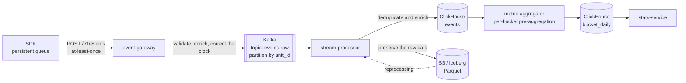

**English** · [日本語](06-data-pipeline-ja.md)

# 06. The data pipeline

The hard parts on mobile come down to two constraints: **C4, late-arriving events**, and **C5,
inaccurate device clocks**. This chapter is the design that answers them.

## 1. The overall flow



**Putting S3 in the position of single source of truth** is the point of the diagram. ClickHouse is
treated as derived data that can be rebuilt, because the day always comes when a bug in the logic
means rebuilding the metrics.

## 2. The event schema

The normative definition is [spec/event.schema.json](../spec/event.schema.json).

```jsonc
{
  "event_id": "01920f3c-...",       // UUIDv7, generated by the client. The key for idempotent deduplication
  "event_name": "$exposure",        // a leading $ is reserved for the SDK
  "unit": {
    "install_id": "3f2c...",
    "user_id": "u_12345",           // null when logged out
    "session_id": "s_8a1b..."
  },
  "app":    { "id": "com.example.app", "version": "5.12.0", "build": "51203" },
  "device": { "platform": "ios", "os_version": "18.2", "model": "iPhone16,1",
              "locale": "ja_JP", "timezone": "Asia/Tokyo" },
  "sdk":    { "name": "abkit-ios", "version": "1.4.0" },
  "client_ts": "2026-07-30T10:00:00.000Z",
  "client_uptime_ms": 128340,       // a monotonic clock, for recovering order within a batch
  "config_version": 8421,
  "config_source": "cached",        // bundled | cached | fetched
  "props": {
    "experiment_key": "checkout_button_v2",
    "variant": "treatment",
    "layer": "checkout",
    "reason": "ASSIGNED",
    "is_override": false
  }
}
```

The fields the server adds:

| Field | Contents |
|---|---|
| `server_ts` | The time the gateway received the event |
| `corrected_ts` | The time the event occurred, after clock correction (§4) |
| `ingest_id` | The ingestion batch identifier, which is the unit of reprocessing |
| `country` | Resolved from the IP address. **The address itself is not stored** |
| `is_late` | True when `server_ts - corrected_ts > 24h` |

## 3. Deduplication (at-least-once into effectively exactly-once)

The client retransmits, so duplicates always arrive. Three layers remove them.

| Layer | Mechanism | What it catches |
|---|---|---|
| Ingestion | A Redis set of `event_id` values, with a 24-hour time to live | Recent retransmissions, which is most of them |
| Storage | ClickHouse `ReplacingMergeTree(ingested_at)` with `ORDER BY (event_id)` | Retransmissions beyond 24 hours |
| Aggregation | `argMax` or `LIMIT 1 BY event_id` in the aggregation query | Rows whose merge has not completed |

**Avoid a query with `FINAL`** — it is expensive. Using `LIMIT 1 BY event_id` on the aggregation
side is faster.

Exposure events are then reduced further during analysis, to the first event per user, experiment,
and day.

## 4. Clock correction (C5)

A device clock cannot be trusted: users change it by hand, they move between time zones, and NTP
does not always synchronize.

### The procedure

For each batch, estimate the skew from `sent_at`, which the client stamps immediately before
sending, and `server_ts`, the time the server received the batch:

```
skew = server_ts - batch.sent_at      # includes network latency, but normally under a few seconds
corrected_ts(e) = e.client_ts + skew
```

Sanity checks on the correction:

| Condition | Handling |
|---|---|
| `\|skew\| < 5 minutes` | Treat correction as unnecessary and take `client_ts` as it stands |
| `5 minutes ≤ \|skew\| < 30 days` | Apply the correction and record `clock_skew_ms` |
| `\|skew\| ≥ 30 days` | The device clock is plainly broken. Fall back to `corrected_ts = server_ts` and set `time_unreliable = true` |
| `corrected_ts > server_ts` | An event from the future is impossible. Clip to `server_ts` |

### Recovering the order within a batch

The order of events inside one batch is decided by `client_uptime_ms`, which increases
monotonically. `client_ts` can move backward if the user changes the clock while the batch is being
built.

**The order of events within a session — an exposure followed by a purchase, say — is judged by that
ordering and no other.** Depending on the wall clock breaks the direction of causality.

## 5. Late-arriving data (C4)

### The expected arrival distribution

| Arrival window | Share |
|---|---|
| Within 1 hour | 92% |
| Within 24 hours | 98% |
| Within 7 days | 99.7% |
| Beyond 7 days | 0.3% |

These numbers get replaced by measurements once the platform runs. **Put the distribution itself on
a dashboard** — a regression in it is an early signal of a client-side defect.

### The recomputation policy

```
Provisional (hourly): recompute the last 24 hours every hour, displayed with a "provisional" label
Final (daily)       : recompute the last 7 days every day (a 7-day watermark)
Frozen (D+14)       : a daily aggregate 14 days old is never recomputed, and later arrivals are dropped
```

**Why freeze at all:** recomputing forever means a published experiment result keeps changing after
the fact, which makes it useless as a record of a decision. The guarantee "frozen at D+14, with
under 0.05% missing after that" is worth more operationally.

### The effect on deciding an experiment is over

Do not draw a conclusion the moment an experiment stops. **Wait seven days after stopping before
finalizing the result.** The user interface enforces that wait: right after a stop it shows
"collecting data" and offers no button to finalize.

## 6. The ClickHouse schema

```sql
CREATE TABLE events (
    event_id        UUID,
    event_name      LowCardinality(String),
    corrected_ts    DateTime64(3),
    server_ts       DateTime64(3),
    install_id      String,
    user_id         String,
    session_id      String,
    app_id          LowCardinality(String),
    app_version     LowCardinality(String),
    platform        LowCardinality(String),
    os_version      LowCardinality(String),
    country         LowCardinality(String),
    config_version  UInt32,
    config_source   LowCardinality(String),
    experiment_key  LowCardinality(String),
    variant         LowCardinality(String),
    reason          LowCardinality(String),
    props           JSON,
    ingested_at     DateTime64(3),
    is_late         UInt8
)
ENGINE = ReplacingMergeTree(ingested_at)
PARTITION BY toYYYYMMDD(corrected_ts)
ORDER BY (app_id, event_name, corrected_ts, event_id)
TTL toDateTime(corrected_ts) + INTERVAL 400 DAY;
```

Use `LowCardinality` everywhere it applies. The events an experimentation platform produces repeat
the same values constantly, and this one choice cuts storage to a fraction.

### The exposure table, as a materialized view

```sql
CREATE MATERIALIZED VIEW exposures_mv
ENGINE = ReplacingMergeTree(first_exposed_at)
ORDER BY (experiment_key, unit_id, toDate(first_exposed_at))
AS SELECT
    experiment_key,
    variant,
    if(randomization_unit = 'user_id', user_id, install_id) AS unit_id,
    min(corrected_ts) AS first_exposed_at,
    any(app_version)  AS app_version_at_exposure,
    any(country)      AS country
FROM events
WHERE event_name = '$exposure' AND reason = 'ASSIGNED'
GROUP BY experiment_key, variant, unit_id, toDate(corrected_ts);
```

## 7. Per-bucket pre-aggregation

Aggregating **into the 10,000 buckets** before any statistics run pays off twice over, in efficiency
and in which methods become available.

```sql
CREATE TABLE bucket_daily (
    experiment_key  LowCardinality(String),
    variant         LowCardinality(String),
    bucket          UInt16,          -- 0..9999
    date            Date,
    app_version     LowCardinality(String),
    metric_key      LowCardinality(String),
    n_units         UInt64,          -- exposed users
    sum_x           Float64,         -- the sum of the metric values
    sum_x2          Float64,         -- the sum of squares, for variance
    sum_pre         Float64,         -- the pre-period values, for CUPED
    sum_pre2        Float64,
    sum_x_pre       Float64          -- for the covariance
)
ENGINE = SummingMergeTree()
ORDER BY (experiment_key, metric_key, variant, date, bucket, app_version);
```

What this shape buys:

1. **Statistical computation becomes constant-time**, independent of the number of users.
2. **The bootstrap and permutation tests run per bucket**, which is far lighter than per user.
3. **The covariance CUPED needs** comes from the same table.
4. **Cluster-robust variance** — for randomization by `account_id` — can be computed by treating a bucket as a cluster.

Keeping the first and second moments plus the cross term is enough to reconstruct every mean,
variance, covariance, and confidence interval. Quantile metrics are the one exception and are
handled separately, by keeping a `quantileTDigestState`.

## 8. Data-quality monitoring

The largest risk is a pipeline that breaks quietly. Monitor each of the following continuously.

| What is monitored | Threshold | What it means |
|---|---|---|
| Exposure count against the previous day | ±20% | An SDK defect or a delivery accident |
| A shift in the distribution of `reason` | Any value moving ±10 points | A targeting misconfiguration |
| The share of `config_source = bundled` | > 5% | Configuration fetches are failing more often |
| The late-arrival rate beyond 24 hours | > 3% | The transmission logic has degraded |
| The share of `time_unreliable` | > 1% | Broken device clocks, or a bug in the correction logic |
| The ratio of exposures between variants | Sample-ratio-mismatch test at p < 0.001 | Assignment itself is broken ([chapter 07](07-statistics.md)) |
| The deduplication rate | > 10% | The client is retransmitting excessively |
| Kafka consumer lag | > 5 minutes | Processing is backing up |

**Run two A/A experiments continuously.** Nothing beats them as an end-to-end test of statistical
soundness. When the false-positive rate departs from its nominal 5%, something in the pipeline or in
the statistical method is broken.

## 9. Privacy

| Requirement | Implementation |
|---|---|
| Deletion requests under the GDPR or Japan's APPI | Put `unit_id` on the deletion queue, then run `ALTER TABLE DELETE` (a lightweight mutation) in ClickHouse and an Iceberg row deletion in S3 |
| Retention | 400 days for events (through the time to live), 5 years for aggregates |
| Keeping personal data out | The gateway validates the keys of `props` against an allow list, and rejects and alerts on anything matching an email-address or phone-number pattern |
| IP addresses | Discarded once the country is resolved, never stored |
| Apps for children | `coppa_mode` reduces `install_id` to session scope |
| The iOS Privacy Manifest | The SDK bundles `PrivacyInfo.xcprivacy`, declaring the data types collected (product interaction, device identifier) and their purposes (analytics, app functionality) |
