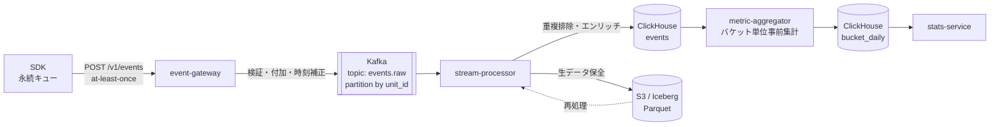

# 06. データパイプライン

モバイル固有の難所は **C4（遅延到着）** と **C5（端末時刻の不正確さ）** に集約される。この章はそのための設計。

## 1. 全体フロー



**S3 を「単一の真実」に置く**のが要点。ClickHouse は再構築可能な派生データとして扱う。ロジックのバグでメトリクスを作り直したくなる場面は必ず来る。

## 2. イベントスキーマ

規範定義は [spec/event.schema.json](../spec/event.schema.json)。

```jsonc
{
  "event_id": "01920f3c-...",       // UUIDv7（クライアント生成）。冪等排除のキー
  "event_name": "$exposure",        // $ 始まりは SDK 予約
  "unit": {
    "install_id": "3f2c...",
    "user_id": "u_12345",           // 未ログインなら null
    "session_id": "s_8a1b..."
  },
  "app":    { "id": "com.example.app", "version": "5.12.0", "build": "51203" },
  "device": { "platform": "ios", "os_version": "18.2", "model": "iPhone16,1",
              "locale": "ja_JP", "timezone": "Asia/Tokyo" },
  "sdk":    { "name": "abkit-ios", "version": "1.4.0" },
  "client_ts": "2026-07-30T10:00:00.000Z",
  "client_uptime_ms": 128340,       // 単調増加時計。バッチ内順序の復元用
  "config_version": 8421,
  "config_source": "cached",        // bundled | cached | fetched
  "props": {
    "experiment_key": "checkout_button_v2",
    "variant": "treatment",
    "layer": "checkout",
    "reason": "ASSIGNED",
    "is_override": false
  }
}
```

サーバが付与するフィールド:

| フィールド | 内容 |
|---|---|
| `server_ts` | gateway での受信時刻 |
| `corrected_ts` | 時刻補正後のイベント発生時刻（§4） |
| `ingest_id` | 取り込みバッチ ID（再処理の単位） |
| `country` | IP から解決。**IP 本体は保存しない** |
| `is_late` | `server_ts - corrected_ts > 24h` |

## 3. 重複排除（at-least-once → 実質 exactly-once）

クライアントは再送するので重複は必ず来る。3 層で排除する。

| 層 | 手段 | 対象 |
|---|---|---|
| 取り込み | Redis の `event_id` セット（TTL 24 時間） | 直近の再送。大半をここで落とす |
| 保管 | ClickHouse `ReplacingMergeTree(ingested_at)` + `ORDER BY (event_id)` | 24 時間を超えた再送 |
| 集計 | 集計クエリで `argMax` / `LIMIT 1 BY event_id` | マージ未完了分 |

**`FINAL` を使ったクエリは避ける**（重い）。集計側で `LIMIT 1 BY event_id` を使うほうが速い。

曝露イベントについては、さらに解析時に「ユーザ × 実験 × 日で最初の 1 件」に丸める。

## 4. 時刻補正（C5）

端末時刻は手動変更・タイムゾーン移動・NTP 未同期で信用できない。

### 手順

バッチごとに、クライアントが送信直前に打刻した `sent_at` とサーバ受信時刻 `server_ts` から skew を推定する:

```
skew = server_ts - batch.sent_at      # ネットワーク遅延を含むが、通常 < 数秒
corrected_ts(e) = e.client_ts + skew
```

補正の妥当性チェック:

| 条件 | 処理 |
|---|---|
| `\|skew\| < 5 分` | 補正不要とみなし `client_ts` をそのまま採用 |
| `5 分 ≤ \|skew\| < 30 日` | 補正を適用。`clock_skew_ms` を記録 |
| `\|skew\| ≥ 30 日` | 端末時計が明らかに壊れている。`corrected_ts = server_ts` にフォールバックし `time_unreliable = true` を立てる |
| `corrected_ts > server_ts` | 未来のイベントはありえない。`server_ts` にクリップ |

### バッチ内の順序復元

同一バッチ内のイベント順序は `client_uptime_ms`（単調増加）で決める。`client_ts` はバッチ生成中にユーザが時計を変えると逆転しうる。

**セッション内のイベント順序（例: 曝露 → 購入）はこの順序でのみ判定する。** 壁時計に依存すると因果の前後が壊れる。

## 5. 遅延到着データ（C4）

### 実測される遅延の分布（想定）

| 到着タイミング | 割合 |
|---|---|
| 1 時間以内 | 92% |
| 24 時間以内 | 98% |
| 7 日以内 | 99.7% |
| 7 日超 | 0.3% |

数値は運用開始後に実測して更新する。**この分布そのものをダッシュボード化する**こと（悪化はクライアントの不具合の早期シグナルになる）。

### 再計算ポリシー

```
速報（hourly）   : 直近 24 時間を毎時再計算。「暫定」ラベル付きで表示
確定（daily）    : 過去 7 日分を毎日再計算（ウォーターマーク 7 日）
凍結（D+14）     : 14 日経過した日次集計は再計算しない。以降の到着分は捨てる
```

**なぜ凍結するか:** 無限に再計算すると、公開済みの実験結果が後から変わり続ける。意思決定の記録として使えない。「D+14 で凍結、それ以降の欠損は 0.05% 未満」という保証のほうが運用上価値が高い。

### 実験終了判定への影響

実験を止めた瞬間に結論を出してはいけない。**停止後 7 日待ってから最終結果を確定する。** これを UI で強制する（停止直後は「データ収集中」と表示し、確定ボタンを出さない）。

## 6. ClickHouse スキーマ

```sql
CREATE TABLE events (
    event_id        UUID,
    event_name      LowCardinality(String),
    corrected_ts    DateTime64(3),
    server_ts       DateTime64(3),
    install_id      String,
    user_id         String,
    session_id      String,
    app_id          LowCardinality(String),
    app_version     LowCardinality(String),
    platform        LowCardinality(String),
    os_version      LowCardinality(String),
    country         LowCardinality(String),
    config_version  UInt32,
    config_source   LowCardinality(String),
    experiment_key  LowCardinality(String),
    variant         LowCardinality(String),
    reason          LowCardinality(String),
    props           JSON,
    ingested_at     DateTime64(3),
    is_late         UInt8
)
ENGINE = ReplacingMergeTree(ingested_at)
PARTITION BY toYYYYMMDD(corrected_ts)
ORDER BY (app_id, event_name, corrected_ts, event_id)
TTL toDateTime(corrected_ts) + INTERVAL 400 DAY;
```

`LowCardinality` を徹底する。実験基盤のイベントは同じ値の繰り返しが多く、これだけでストレージが数分の一になる。

### 曝露テーブル（マテリアライズドビュー）

```sql
CREATE MATERIALIZED VIEW exposures_mv
ENGINE = ReplacingMergeTree(first_exposed_at)
ORDER BY (experiment_key, unit_id, toDate(first_exposed_at))
AS SELECT
    experiment_key,
    variant,
    if(randomization_unit = 'user_id', user_id, install_id) AS unit_id,
    min(corrected_ts) AS first_exposed_at,
    any(app_version)  AS app_version_at_exposure,
    any(country)      AS country
FROM events
WHERE event_name = '$exposure' AND reason = 'ASSIGNED'
GROUP BY experiment_key, variant, unit_id, toDate(corrected_ts);
```

## 7. バケット単位の事前集計

統計処理の前に、**10,000 バケット単位に集計しておく**のが効率と手法の両面で効く。

```sql
CREATE TABLE bucket_daily (
    experiment_key  LowCardinality(String),
    variant         LowCardinality(String),
    bucket          UInt16,          -- 0..9999
    date            Date,
    app_version     LowCardinality(String),
    metric_key      LowCardinality(String),
    n_units         UInt64,          -- 曝露ユーザ数
    sum_x           Float64,         -- メトリクス値の合計
    sum_x2          Float64,         -- 二乗和（分散計算用）
    sum_pre         Float64,         -- 事前期間の値（CUPED 用）
    sum_pre2        Float64,
    sum_x_pre       Float64          -- 共分散計算用
)
ENGINE = SummingMergeTree()
ORDER BY (experiment_key, metric_key, variant, date, bucket, app_version);
```

この形にしておく利点:

1. **統計計算が定数時間**になる。ユーザ数に依存しない。
2. **ブートストラップ／並べ替え検定がバケット単位でできる**（ユーザ単位より遥かに軽い）。
3. **CUPED に必要な共分散**が同じテーブルから取れる。
4. **クラスタ頑健分散**（`account_id` 単位のランダム化）もバケットをクラスタとみなして計算できる。

一次・二次モーメントと交差項さえ保持すれば、平均・分散・共分散・信頼区間はすべて再構成できる。分位点メトリクスだけは別扱いで、`quantileTDigestState` を保持する。

## 8. データ品質モニタリング

パイプラインが静かに壊れることが最大のリスク。以下を常時監視する。

| 監視項目 | 閾値 | 意味 |
|---|---|---|
| 曝露イベント数の前日比 | ±20% | SDK 不具合・配信事故 |
| `reason` の分布変化 | 任意の値が ±10pt | ターゲティング設定ミス |
| `config_source = bundled` の割合 | > 5% | コンフィグ取得の失敗が増えている |
| 遅延到着率（>24h） | > 3% | 送信ロジックの劣化 |
| `time_unreliable` の割合 | > 1% | 端末時計の異常、または補正ロジックのバグ |
| バリアント間の曝露数比 | SRM 検定 p < 0.001 | 割当そのものが壊れている（[07 章](07-statistics.md)） |
| 重複排除率 | > 10% | クライアントの再送が過剰 |
| Kafka コンシューマラグ | > 5 分 | 処理の詰まり |

**A/A 実験を常時 2 本走らせる。** 統計的な健全性の end-to-end テストとして、これに勝るものはない。偽陽性率が名目水準（5%）から外れたら、パイプラインか統計手法のどこかが壊れている。

## 9. プライバシー対応

| 要件 | 実装 |
|---|---|
| 削除リクエスト（GDPR/APPI） | `unit_id` を削除キューへ → ClickHouse の `ALTER TABLE DELETE`（軽量ミューテーション）+ S3 の Iceberg 行削除 |
| 保持期間 | イベント 400 日（TTL）、集計 5 年 |
| PII を載せない | gateway で `props` のキーを許可リスト方式で検証。メールアドレス・電話番号のパターンを検出したら拒否しアラート |
| IP | 国コード解決後に破棄。保存しない |
| 子ども向けアプリ | `coppa_mode` で `install_id` をセッションスコープに落とす |
| iOS Privacy Manifest | SDK に `PrivacyInfo.xcprivacy` を同梱し、収集データ種別（Product Interaction / Device ID）と用途（Analytics / App Functionality）を宣言 |
