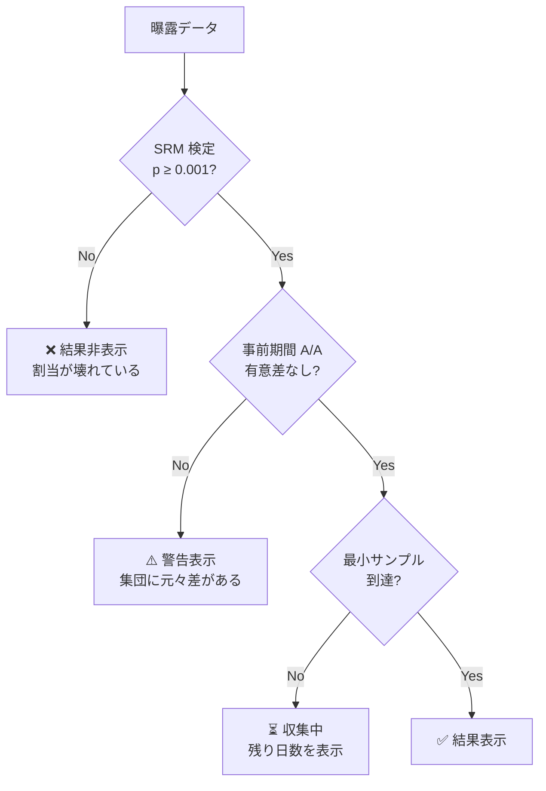

# 07. 統計設計

フィーチャーフラグ配信基盤と A/B テストプラットフォームを分けるのはこの章の内容。ここが雑だと「実験はできるが結論が間違っている」基盤になる。

本章の数値例は `NormalDist` ベースの計算で検証済み（両側 α=0.05、検出力 80%）。

## 1. 診断が先、推定は後

**結果画面を出す前に、必ず診断を通す。** 診断に落ちた実験は結果を表示しない（数値を出すと必ず読まれてしまうため、グレーアウトではなく非表示にする）。



## 2. SRM（Sample Ratio Mismatch）

50/50 で割り当てたはずのバリアント間で曝露ユーザ数が想定比率からずれる現象。**A/B テストで最も頻繁かつ最も致命的な障害**で、これが出ている実験の結果は例外なく信用できない。

### 検定

自由度 1 のカイ二乗検定（多バリアントなら k-1）。**閾値は p < 0.001**（0.05 ではない — 多数の実験を常時監視するため）。

```
χ² = Σ (observed_i - expected_i)² / expected_i
```

### 検出力の実際

| 曝露数 | 実際の比率のずれ | χ² | p 値 | 判定 |
|---|---|---|---|---|
| 50,000 vs 49,500 | 0.50% | 2.51 | 0.11 | ok |
| 50,000 vs 49,000 | 1.01% | 10.10 | 1.5×10⁻³ | ok（境界） |
| 100,000 vs 98,800 | 0.60% | 7.24 | 7.1×10⁻³ | ok |
| 500,000 vs 497,000 | 0.30% | 9.03 | 2.7×10⁻³ | ok |

サンプルが増えるほど微小なずれも検出できる。大規模実験では 0.3% のずれでも警告水準に近づく。

### SRM の主な原因（モバイル固有のものを含む）

| 原因 | 見分け方 |
|---|---|
| バリアント間でクラッシュ率が違う | treatment のクラッシュ後に曝露が送れず欠損。クラッシュ率をブレイクダウン |
| 曝露記録の位置がバリアント間で非対称 | control 側で `variant()` を呼び忘れている。コードレビューで潰す |
| バリアント間でイベント送信量が違い、キュー溢れの頻度が変わる | `queue_dropped` メトリクスをバリアント別に見る |
| 実験途中でのトラフィック配分変更 | 監査ログと突き合わせる。変更日以降で分割して再検定 |
| ボット・自動テスト | 特定の `install_id` パターンの集中 |
| 遅延到着の非対称性 | `is_late` 率をバリアント別に確認。D+7 で再検定すると解消することがある |

**SRM が出たら実験は捨てる。** 原因を直して再実行するのが唯一の正しい対応で、「多分大丈夫だろう」で読んではいけない。

## 3. サンプルサイズと所要期間

実験を**開始する前に**必要サンプル数と所要日数を提示する。これがないと「なんとなく 1 週間回して有意じゃないからやめる」という検出力不足の実験が量産される。

比率メトリクスの必要サンプル数（両側 α=0.05、検出力 80%、1 群あたり）:

| ベースライン CVR | 相対 MDE | 必要 n/群 | 合計 |
|---|---|---|---|
| 5% | 2% | 752,703 | 1,505,406 |
| 5% | 5% | 122,124 | 244,248 |
| 5% | 10% | 31,234 | 62,468 |
| 30% | 2% | 92,089 | 184,178 |
| 2% | 5% | 315,206 | 630,412 |

**この表が示す現実:** DAU 100 万のアプリでも、CVR 5% に対して 2% の相対改善を検出するには全トラフィックの 20% 割当で 7.5 日、100% 割当でも 1.5 日分の**新規曝露**が要る。小さな改善を測るのは想像より遥かに高くつく。

Console では実験作成時に「この設定なら結論まで N 日」を表示し、90 日を超える場合は警告を出す。

### モバイル特有の補正

- **曝露は新規ユーザの流入で増えるのではなく、既存ユーザのアプリ起動で増える。** DAU ではなく「対象画面への到達 UU」で見積もる。
- **最低 1 週間は回す。** 曜日効果があるため、7 日未満の実験は週内変動と交絡する。サンプル数が早期に足りても 7 日は待つ。
- **アプリバージョンの普及を待つ。** 実験対象バージョンの普及率が 50% を超えてから開始しないと、初期の被験者が「早期アップデータ」に偏る（C3）。

## 4. 効果推定

### 基本

| メトリクス種別 | 手法 |
|---|---|
| 平均値（`mean`） | Welch の t 検定（等分散を仮定しない）。バケット集計の一次・二次モーメントから計算 |
| 比率（`proportion`） | 二項比率の差。大標本なので正規近似で十分 |
| 比（`ratio`、例: クリック数/表示数） | **デルタ法**。分子と分母が同一ユーザ内で相関するため単純な比の分散では過小評価になる |
| カウント（`count`） | 対数変換 or ポアソン回帰。ゼロ過剰なら hurdle モデル |
| 分位点（`quantile`） | t-digest + ブートストラップ。バケット単位のリサンプリング |

### 外れ値処理

課金額のようなロングテールメトリクスは、1 人の高額ユーザが結果を左右する。

- **winsorize（99.9 パーセンタイルでクリップ）を既定**にする。切り捨てではなくクリップ。
- クリップ前後の両方を表示し、乖離が大きい場合は警告する（乖離自体が「効果が一部ユーザに集中している」という重要な情報）。
- 閾値は実験開始前に固定する。結果を見てから決めてはいけない。

### クラスタ頑健分散

ランダム化単位が `account_id`（家族・法人）で、メトリクスがユーザ単位の場合、観測は独立でない。クラスタ内相関を無視すると分散が過小になり**偽陽性が激増する**。

バケットをクラスタとみなしたバケット単位のブートストラップで対処する。これがバケット事前集計（[06 章 §7](06-data-pipeline.md#7-バケット単位の事前集計)）を採用した理由のひとつ。

## 5. CUPED による分散削減

実験開始前の期間における同一メトリクスを共変量として使い、分散を削減する。

```
Y_adjusted = Y - θ(X_pre - E[X_pre])
   ただし θ = Cov(Y, X_pre) / Var(X_pre)

Var(Y_adjusted) = Var(Y) · (1 - ρ²)
```

| 事前期間との相関 ρ | 分散 | 必要サンプル | 実効的な検出力効率 |
|---|---|---|---|
| 0.3 | 91% | 91% | 1.10 倍 |
| 0.5 | 75% | 75% | 1.33 倍 |
| 0.7 | 51% | 51% | 1.96 倍 |
| 0.8 | 36% | 36% | 2.78 倍 |

**実務上のインパクトが最も大きい施策。** 課金額・利用時間のような継続性の高いメトリクスは ρ が 0.6〜0.8 になることが多く、実験期間を半分にできる。

### モバイルでの注意

- 事前期間のデータは**曝露時点より前**でなければならない。曝露が実験開始日にばらつくため、ユーザごとに「曝露日の 14 日前〜曝露日」を事前期間とする。
- 新規インストールユーザには事前期間が存在しない。**新規と既存でセグメントを分け、既存にのみ CUPED を適用する**（新規は θ=0 として扱う）。
- θ は control 群のみから推定する（treatment から推定すると効果推定にバイアスが入る）。

## 6. 逐次検定（peeking 問題）

固定水平の t 検定を毎日眺めると、偽陽性率は名目 5% を大きく超える（10 回覗けば約 30%）。実験基盤はダッシュボードで常時見られるので、**この問題は避けられない。手法で解く。**

| 手法 | 評価 |
|---|---|
| **mSPRT（always-valid confidence interval）** | ✅ 採用。いつ見ても妥当な信頼区間。停止規則が不要で運用が単純 |
| Group Sequential（O'Brien-Fleming） | 事前に覗くタイミングを決める必要があり、モバイルの実験運用と相性が悪い |
| ベイズ（事後確率） | 直感的だが事前分布の選択が恣意的になりやすく、組織内での合意形成が難しい |
| 固定水平のみ | 実験終了まで結果を見せない運用は現実には守られない |

**設計:**
- ダッシュボードには**常に always-valid CI** を表示する。
- 事前に宣言したサンプルサイズに到達した時点の固定水平検定の結果も併記する（こちらのほうが検出力が高い）。
- **ガードレールは必ず逐次検定**。15 分ごとに評価するので固定水平では機能しない。

always-valid CI は固定水平より広い（＝保守的）。これは「いつでも見られる」ことの対価で、検出力を約 20〜30% 犠牲にする。それでも peeking による偽陽性より遥かにましである。

## 7. 多重比較

1 実験で 20 個のメトリクスを見れば、α=0.05 のもとで平均 1 個は偶然有意になる。

| 対象 | 補正 |
|---|---|
| **主要指標（1 つ）** | 補正しない。事前に 1 つだけ宣言させる |
| 二次指標 | Benjamini-Hochberg（FDR 制御）。「発見のためのスクリーニング」なので FWER 制御は厳しすぎる |
| ガードレール | 補正しない。**見逃しのコストのほうが高い**ので検出力を優先 |
| バリアント数 k ≥ 3 | Dunnett 法（対照群との多重比較） |
| セグメント別ブレイクダウン | 補正必須。かつ「探索的分析」と明示ラベル。ここから結論を出さない運用ルール |

**主要指標を 1 つに強制する**のが最も効く。実験作成時に必須項目にし、後から変更したら監査ログに残す。

## 8. モバイル特有の解析上の論点

### 8.1 新奇性効果（novelty effect）

UI 変更は最初の数日だけ効果が出て、その後消えることがある。

**検出:** 曝露からの経過日数別に効果量を推定し、時系列トレンドを見る。単調減衰していれば新奇性を疑う。最低 2 週間回して後半 1 週間の効果を見る。

### 8.2 初回起動バイアス

`config_source = bundled` のユーザ（C6）は初回起動ユーザに偏る。バンドル版コンフィグは最新でない可能性があるため、割当が本来と異なる場合がある。

**対処:** `config_source` を必ずブレイクダウン軸として提供し、`bundled` の割合が高い実験には警告を出す。

### 8.3 アプリバージョン混在（C3）

実験期間中に新バージョンが配信されると、更新したユーザとしていないユーザで集団が分かれる。

**対処:** `app_version` を共変量に含める。あるいは実験対象を単一バージョンに固定する（推奨だが、実験期間が短くなる）。バージョン別ブレイクダウンを標準表示にする。

### 8.4 生存者バイアス

アンインストールしたユーザはイベントを送らない。treatment のほうがアンインストール率が高い場合、残ったユーザだけを見ると treatment が良く見える。

**対処:** **リテンション（D1/D7/D30）を全実験の必須ガードレール**にする。「主要指標は改善したがリテンションが落ちた」を必ず検出できる状態にする。

### 8.5 ネットワーク効果・干渉

ソーシャル機能の実験では、treatment ユーザの行動が control ユーザに影響し SUTVA が破れる。

**対処:** クラスタランダム化（地域・ソーシャルグラフのコミュニティ単位）。ただし検出力が大幅に落ちるため、干渉が実際に想定される実験に限定する。

## 9. A/A テストによる継続的検証

**本番で常時 2 本の A/A 実験を走らせる。** 全ユーザを対象に 50/50 で分割し、実質的な差がないことを確認し続ける。

| 監視項目 | 期待値 | 逸脱時の意味 |
|---|---|---|
| 全メトリクスの p 値分布 | 一様分布 | 分散推定が誤っている |
| 偽陽性率（α=0.05） | 5% | 有意に超えるなら手法かパイプラインが壊れている |
| SRM 検定 | 常に通過 | 割当ロジックの不具合 |
| always-valid CI の被覆率 | ≥ 95% | 逐次検定の実装ミス |

A/A の偽陽性率が名目水準から外れたときは、**新規実験の開始を止める**運用にする。壊れた基盤で出した結論は、結論がないより有害。

## 10. 結果の提示

数値をそのまま出すと必ず誤読される。提示の仕方まで設計に含める。

| 原則 | 実装 |
|---|---|
| 点推定より信頼区間 | 「+2.3%」ではなく「+2.3% [−0.4%, +5.0%]」を主表示にする |
| 「有意差なし」≠「差がない」 | 検出力不足の場合は「この実験では ±X% より小さい差は検出できません」と明記 |
| 実質的有意性 | 統計的有意と、事前宣言した MDE を超えたかを**別々に**表示 |
| 意思決定の記録 | 結果に対する判断（採用／不採用／再実験）とその理由を必須入力にして保存。後から実験の質を振り返れるようにする |
| 探索的分析の明示 | セグメント別の結果には「探索的」ラベルを機械的に付与し、確証的結論に使えないことを示す |
