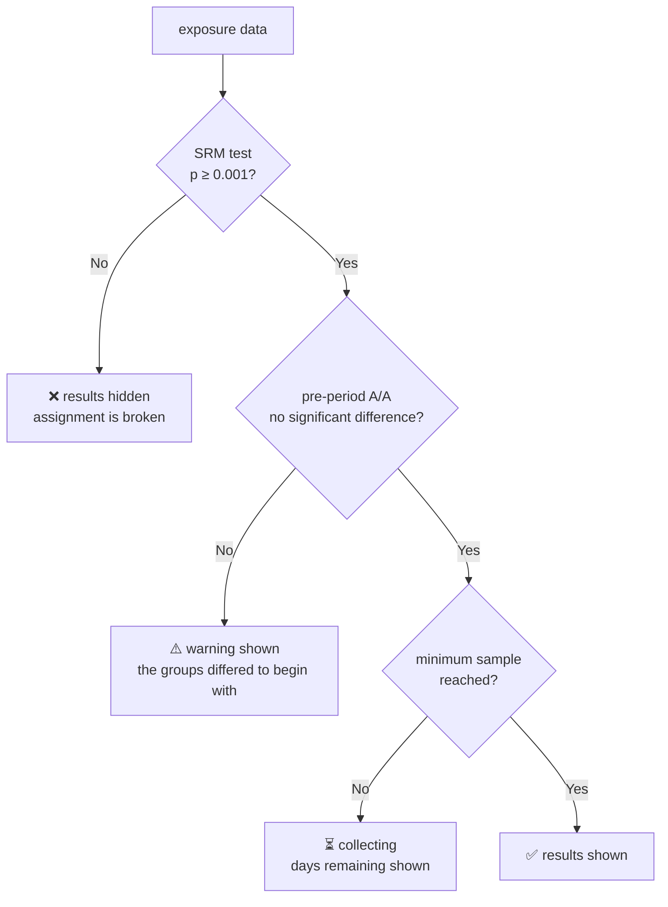

**English** · [日本語](07-statistics-ja.md)

# 07. Statistical design

What separates a feature-flag delivery system from an A/B testing platform is the content of this
chapter. Treat it carelessly and the result is a platform that can run experiments but reaches wrong
conclusions.

The numeric examples here were verified with `NormalDist`-based calculations, at a two-sided α of
0.05 and 80% power.

## 1. Diagnostics first, estimation second

**Every result passes diagnostics before it is shown.** An experiment that fails a diagnostic gets
no result screen at all — not a grayed-out one, because a number on screen will be read no matter
how it is styled.



## 2. Sample ratio mismatch

A sample ratio mismatch (SRM) is the phenomenon where the number of exposed users per variant
departs from the intended split — from 50/50, for instance. It is **the most frequent and the most
damaging failure in A/B testing**, and the result of an experiment showing one is without exception
untrustworthy.

### The test

A chi-squared test with one degree of freedom, or k−1 for k variants. **The threshold is p < 0.001**,
not 0.05, because many experiments are monitored continuously.

```
χ² = Σ (observed_i - expected_i)² / expected_i
```

### The power in practice

| Exposures | Actual departure from the ratio | χ² | p | Verdict |
|---|---|---|---|---|
| 50,000 vs 49,500 | 0.50% | 2.51 | 0.11 | ok |
| 50,000 vs 49,000 | 1.01% | 10.10 | 1.5×10⁻³ | ok (borderline) |
| 100,000 vs 98,800 | 0.60% | 7.24 | 7.1×10⁻³ | ok |
| 500,000 vs 497,000 | 0.30% | 9.03 | 2.7×10⁻³ | ok |

The larger the sample, the smaller the departure the test detects. In a large experiment even a 0.3%
departure approaches the warning level.

### The main causes, including the mobile-specific ones

| Cause | How to spot it |
|---|---|
| Crash rates differ between variants | An exposure cannot be sent after a crash in treatment, so it goes missing. Break the crash rate down by variant |
| Exposure is recorded asymmetrically between variants | `variant()` is not being called on the control path. Catch it in code review |
| Event volume differs between variants, changing how often the queue overflows | Look at the `queue_dropped` metric per variant |
| Traffic allocation changed mid-experiment | Cross-check the audit log, then split at the change date and retest |
| Bots or automated tests | A concentration of a particular `install_id` pattern |
| Asymmetric late arrivals | Check the `is_late` rate per variant. Retesting at D+7 sometimes clears it |

**An experiment with a sample ratio mismatch gets thrown away.** Fixing the cause and rerunning is
the only correct response, and reading the numbers anyway on the hope that they are probably fine is
not an option.

## 3. Sample size and duration

Present the required sample size and the expected duration **before the experiment starts**. Without
that, the organization mass-produces underpowered experiments that run for about a week and get
abandoned for lack of significance.

The sample size required per group for a proportion metric, at a two-sided α of 0.05 and 80% power:

| Baseline conversion rate | Relative minimum detectable effect | Required n per group | Total |
|---|---|---|---|
| 5% | 2% | 752,703 | 1,505,406 |
| 5% | 5% | 122,124 | 244,248 |
| 5% | 10% | 31,234 | 62,468 |
| 30% | 2% | 92,089 | 184,178 |
| 2% | 5% | 315,206 | 630,412 |

**What the table says about reality:** even an app with a million daily active users needs 7.5 days
of **new exposures** at a 20% traffic allocation to detect a 2% relative improvement on a 5%
conversion rate, and 1.5 days at a 100% allocation. Measuring a small improvement costs far more
than expected.

The console shows "N days to a conclusion with these settings" when an experiment is created, and
warns when N exceeds 90.

### Corrections specific to mobile

- **Exposures accumulate from existing users opening the app, not from new users arriving.** Estimate from unique users reaching the screen in question, not from daily active users.
- **Run for at least a week.** Day-of-week effects mean an experiment shorter than seven days is confounded with within-week variation. Wait the seven days even when the sample arrives early.
- **Wait for the app version to spread.** Starting before the targeted version passes 50% adoption biases the early subjects toward users who update early (constraint C3).

## 4. Effect estimation

### The basics

| Metric type | Method |
|---|---|
| Mean (`mean`) | Welch's t-test, which does not assume equal variances, computed from the first and second moments of the bucket aggregates |
| Proportion (`proportion`) | The difference of two binomial proportions. The samples are large, so a normal approximation suffices |
| Ratio (`ratio`, such as clicks per impression) | **The delta method.** The numerator and denominator correlate within a user, so the naive variance of a ratio underestimates |
| Count (`count`) | A log transform or Poisson regression, or a hurdle model when zeros are excessive |
| Quantile (`quantile`) | t-digest plus the bootstrap, resampling per bucket |

### Handling outliers

A long-tailed metric such as revenue lets a single high-spending user swing the result.

- **Winsorizing at the 99.9th percentile is the default** — clipping the values rather than dropping the users.
- Show the result both before and after clipping, and warn when the two diverge widely, because the divergence itself carries the important information that the effect is concentrated in a few users.
- Fix the threshold before the experiment starts. It must never be chosen after seeing the results.

### Cluster-robust variance

When the randomization unit is `account_id` — a family or a company — and the metric is per user,
the observations are not independent. Ignoring the intra-cluster correlation understates the
variance and **produces a flood of false positives**.

The answer is a bucket-level bootstrap that treats a bucket as a cluster. That method is one of the
reasons this design pre-aggregates per bucket
([chapter 06 §7](06-data-pipeline.md#7-per-bucket-pre-aggregation)).

## 5. Variance reduction with CUPED

Controlled experiments using pre-experiment data (CUPED) uses the same metric measured before the
experiment as a covariate, and reduces the variance.

```
Y_adjusted = Y - θ(X_pre - E[X_pre])
   where θ = Cov(Y, X_pre) / Var(X_pre)

Var(Y_adjusted) = Var(Y) · (1 - ρ²)
```

| Correlation ρ with the pre-period | Variance | Required sample | Effective gain in power |
|---|---|---|---|
| 0.3 | 91% | 91% | 1.10× |
| 0.5 | 75% | 75% | 1.33× |
| 0.7 | 51% | 51% | 1.96× |
| 0.8 | 36% | 36% | 2.78× |

**No other technique here has as much practical impact.** A persistent metric such as revenue or
time spent often reaches a ρ of 0.6 to 0.8, which halves the experiment duration.

### Cautions on mobile

- The pre-period data must come from **before the moment of exposure**. Exposure dates vary across users, so the pre-period is defined per user as the 14 days before that user's exposure.
- A newly installed user has no pre-period at all. **Segment new users from existing ones and apply CUPED only to the existing ones**, treating new users as θ = 0.
- Estimate θ from the control group alone. Estimating it from treatment biases the effect estimate.

## 6. Sequential testing and the peeking problem

Looking at a fixed-horizon t-test every day pushes the false-positive rate far above its nominal 5%
— about 30% after ten looks. An experimentation platform puts a dashboard in front of people all
day, so **the problem cannot be avoided by policy and must be solved by method.**

| Method | Assessment |
|---|---|
| **mSPRT, giving an always-valid confidence interval** | ✅ Selected. The interval is valid whenever it is read, no stopping rule is required, and operating it stays simple |
| Group sequential (O'Brien-Fleming) | It requires deciding the look times in advance, which fits mobile experiment operations poorly |
| Bayesian posterior probabilities | Intuitive, but the choice of prior turns arbitrary, which makes agreement within an organization hard |
| Fixed horizon only | A policy of hiding results until the experiment ends is never actually followed |

**The design:**
- The dashboard **always shows the always-valid confidence interval**.
- Alongside it, the console shows the fixed-horizon result as of the pre-declared sample size, which has more power.
- **Guardrails always use a sequential test.** They are evaluated every 15 minutes, where a fixed horizon does not work at all.

An always-valid confidence interval is wider, and therefore more conservative, than a fixed-horizon
one. That width is the price of being readable at any moment, and it costs roughly 20 to 30% of the
power — still far better than the false positives peeking produces.

## 7. Multiple comparisons

Looking at 20 metrics in one experiment yields, on average, one spuriously significant result at an
α of 0.05.

| Target | Correction |
|---|---|
| **The primary metric (exactly one)** | None. Exactly one is declared in advance |
| Secondary metrics | Benjamini-Hochberg, controlling the false discovery rate. These are a screen for discoveries, so controlling the family-wise error rate would be too strict |
| Guardrails | None. **Missing a regression costs more**, so power takes priority |
| Three or more variants | Dunnett's test, comparing each variant against control |
| Per-segment breakdowns | Correction is mandatory, and the label "exploratory" is applied. The operating rule is that no conclusion comes from here |

**Forcing a single primary metric does more than any correction.** The console makes it a required
field at creation, and any later change lands in the audit log.

## 8. Analysis questions specific to mobile

### 8.1 Novelty effects

A user-interface change can show an effect for the first few days and then lose it.

**Detection:** estimate the effect size by days since exposure and look at the trend. A monotonic
decay suggests novelty. Run for at least two weeks and read the effect over the second week.

### 8.2 First-launch bias

Users with `config_source = bundled` (constraint C6) skew toward first launches. The bundled
configuration may not be the latest, so their assignment can differ from what it would otherwise be.

**The answer:** always offer `config_source` as a breakdown dimension, and warn on an experiment
where the `bundled` share runs high.

### 8.3 Mixed app versions (C3)

When a new version ships during an experiment, the population divides into users who updated and
users who did not.

**The answer:** include `app_version` as a covariate, or fix the experiment to a single version,
which is preferable but shortens the window. Make the per-version breakdown a standard display.

### 8.4 Survivorship bias

A user who uninstalls sends no events. When treatment has the higher uninstall rate, looking only at
the users who remain makes treatment look better than it is.

**The answer:** make **retention at day 1, day 7, and day 30 a mandatory guardrail on every
experiment**, so that "the primary metric improved but retention fell" is always detectable.

### 8.5 Network effects and interference

In an experiment on a social feature, the behavior of treatment users affects control users, which
breaks the stable unit treatment value assumption.

**The answer:** cluster randomization, by region or by community in the social graph. It costs a
great deal of power, so restrict it to experiments where interference is genuinely expected.

## 9. Continuous verification through A/A tests

**Run two A/A experiments continuously in production.** Split every user 50/50 and keep confirming
that no material difference appears.

| What is monitored | Expected | What a departure means |
|---|---|---|
| The distribution of p-values across all metrics | Uniform | The variance estimate is wrong |
| The false-positive rate at α = 0.05 | 5% | Significantly above it means the method or the pipeline is broken |
| The sample-ratio-mismatch test | Always passes | A defect in the assignment logic |
| The coverage of the always-valid confidence interval | ≥ 95% | A mistake in the sequential-test implementation |

When the A/A false-positive rate departs from its nominal level, the operating rule is to **stop
starting new experiments**. A conclusion drawn on a broken platform is worse than no conclusion.

## 10. Presenting results

Numbers presented raw are always misread, so presentation belongs in the design.

| Principle | Implementation |
|---|---|
| Confidence intervals over point estimates | The headline reads "+2.3% [−0.4%, +5.0%]", not "+2.3%" |
| "Not significant" is not "no difference" | When power is short, state it: "this experiment cannot detect a difference smaller than ±X%" |
| Practical significance | Show statistical significance and passing the pre-declared minimum detectable effect **separately** |
| A record of the decision | Require the judgment on the result — adopt, reject, or rerun — and the reasoning behind it, and store both, so the quality of past experiments can be reviewed later |
| Exploratory analysis, marked as such | Attach the "exploratory" label mechanically to per-segment results, showing that they cannot support a confirmatory conclusion |
